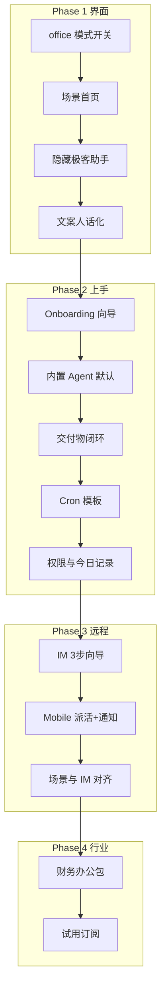

# Coworker 白领版改造规划

> **目标用户**：从未用过 Agent 的白领、财务/审计人员、小公司行政与运营  
> **产品心智**：「AI 同事」—— 派活、确认、拿交付物，而不是「选 Agent、配 MCP、挂 Skill」  
> **明确不做（本阶段）**：Agent 自动下载安装、环境管家全自动、财务 OCR 垂直包（可放在 Phase 4+）

**文档版本**：2026-06-17  
**实现开关**：`ui.experienceMode` = `office`（办公简洁模式，默认）| `power`（完整开发者界面）

---

## 实施进度摘要

| 阶段 | 状态 | 说明 |
|------|------|------|
| **Phase 1** | 🟡 进行中（主体已落地） | 办公模式、场景首页、极客 UI 隐藏、Agent 下拉选择 |
| **Phase 2** | ⬜ 未开始 | Onboarding、交付闭环、Cron 模板 |
| **Phase 3** | ⬜ 未开始 | Mobile / IM 派活 |
| **Phase 4** | ⬜ 未开始 | 行业包、商业化 |

### Phase 1 已完成项

- [x] **办公简洁模式开关**：`ui.experienceMode`，默认 `office`；设置 → 系统 →「办公简洁模式」
- [x] **场景化首页**：6 个场景卡片（做表格 / 写文档 / 做汇报 / 整理文件 / 定时任务 / 随便问问）
- [x] **示例话术**：每场景 3 条，可一键填入输入框
- [x] **助手收敛**：12 个非办公助手默认隐藏，「更多助手…」可展开
- [x] **隐藏极客元素**：Agent 药丸栏、@Agent、模型选择、YOLO/模式切换、技能/MCP、底部快捷链接、助手编辑按钮
- [x] **Agent 选择（办公向）**：输入框左下角药丸下拉 `GuidAgentSelector`（含说明文案与 Agent 描述）
- [x] **场景图标**：`@icon-park/react` outline 风格，与项目一致
- [x] **文案 i18n**：`guid.office.*` 九语言

### Phase 1 待收尾

- [ ] 对话页 SendBox 办公模式一致性（侧边栏、对话内高级控件）
- [ ] 错误提示全面「人话化」（`acp_init_failed` 等）
- [ ] 验收：新用户 10 秒内理解「这是办公工具」

---

## 一、改造原则（所有阶段都遵守）

| 原则 | 含义 |
|------|------|
| **藏技术、露场景** | 前台只出现「做表格 / 写文档 / 整理文件」，不出现 Agent、MCP、ACP |
| **默认安全** | 改文件前确认；默认不用 YOLO；授权文件夹边界清晰 |
| **第一次必须成功** | 新用户 5 分钟内拿到一个能打开的 Excel 或 Word |
| **一个主入口** | 默认只有一个「AI 同事」，不逼用户选后端 |
| **渐进暴露** | 高级能力进「高级设置」，不删代码，只改默认可见性 |
| **小步可验证** | 每阶段都能单独 Demo、单独给试点用户试用 |

---

## 二、改造总览（四阶段）


| 阶段 | 周期（估） | 核心问题 | 用户感受 |
|------|-----------|----------|----------|
| **Phase 1** | 2–3 周 | 「打开软件不知道干啥」 | 像办公软件，不像开发者工具 |
| **Phase 2** | 2–3 周 | 「第一次用失败了」 | 装完就能出一份表/文档 |
| **Phase 3** | 3–4 周 | 「人不在电脑前也想派活」 | 微信/飞书/手机能遥控 |
| **Phase 4** | 持续 | 「能不能更贴我工作」 | 财务包、模板、付费转化 |

**为什么这个顺序：**

1. **先改「看得懂」再改「用得顺」**—— 界面不对，后面功能做了也没人走到
2. **再保首次成功**—— 白领耐心极低，第一次失败就不会再来
3. **再做远程派活**—— 这是差异化，但依赖前两步心智已建立
4. **最后做行业包**—— 在通用白领体验跑通后，财务/审计才是可售溢价

---

## Phase 1：能看懂、敢点（界面与信息架构）

**要解决的问题：** 用户打开 Coworker 看到 21 个助手、Agent 药丸栏、技能/MCP，直接关掉。

### 1.1 新增「办公简洁模式」开关

**做什么：**

- 运行模式：`power`（完整界面） / `office`（白领默认）
- `office` 下：隐藏多 Agent 药丸栏、技能开关、MCP、YOLO、模型选择等
- 设置里保留「切换到高级模式」供深度用户
- Agent 选择在输入框左下角以**下拉药丸**呈现（带文字说明，非纯 logo）

**为什么先做这个：**

- 不动后端逻辑，只控 UI 展示，**风险最小、见效最快**
- 后续所有改造都挂在 `office` 模式下，避免和极客功能打架

**主要涉及：**

| 文件 | 作用 |
|------|------|
| `common/types/ui/experienceMode.ts` | 模式类型与默认值 |
| `hooks/ui/useExperienceMode.ts` | 读取/切换模式 |
| `common/config/configKeys.ts` | `ui.experienceMode` 配置项 |
| `components/settings/.../SystemModalContent` | 设置页开关 |
| `pages/guid/GuidPage.tsx` | 办公/专业模式分支 |
| `pages/guid/components/GuidActionRow.tsx` | 输入框底栏 |
| `pages/guid/components/GuidAgentSelector.tsx` | Agent 下拉选择器 |

---

### 1.2 重做首页：场景入口，取代助手墙

**做什么：**

首页（GuidPage）在 `office` 模式下展示 **6 个场景卡片**：

| 场景 ID | 用户文案 | 背后（用户不可见） |
|---------|----------|-------------------|
| `spreadsheet` | 做表格 | `excel-creator` |
| `document` | 写文档 | `word-creator` |
| `presentation` | 做汇报 | `ppt-creator` |
| `organize` | 整理文件 | `cowork` |
| `scheduled` | 定时任务 | 跳转 `/scheduled` |
| `general` | 随便问问 | `cowork` |

每个卡片下 **3 条示例话术**（可点击填入输入框）。

**为什么第二步就做：**

- 白领不认「助手」，认 **「我要干什么」**
- 复用现有预置助手，只是 **换壳 + 路由**，不新写 Agent 引擎

**主要涉及：**

| 文件 | 作用 |
|------|------|
| `pages/guid/config/officeScenes.ts` | 场景 → 助手 / 路由 / 话术 key |
| `pages/guid/components/OfficeSceneGrid.tsx` | 场景卡片网格 |
| `pages/guid/components/OfficeSceneIcon.tsx` | 场景图标（Icon Park） |
| `pages/guid/AssistantSelectionArea` | 场景话术与助手选择区 |

---

### 1.3 收敛助手列表：默认只露办公相关

**做什么：**

`office` 模式下助手列表 **默认隐藏** 以下 12 个非办公助手（`OFFICE_HIDDEN_ASSISTANT_IDS`）：

- 游戏 3D、角色扮演、moltbook、UI 设计、论文、OpenClaw 配置、3D PPT、Pitch Deck、Dashboard、Human 3 Coach、社交招聘、Beautiful Mermaid、Morph PPT 等

底部 **「更多助手…」** 可查看其余办公类助手。

**为什么：**

- 无关助手会削弱「专业办公工具」信任感，财务/行政尤其敏感

---

### 1.4 统一对外文案与品牌语气

**做什么：**

- 窗口标题、欢迎语、按钮：用「AI 同事」「派活」「交付物」，不用 Agent / Cowork / MCP
- 错误提示改人话：「AI 同事暂时无法修改文件」而不是 `acp_init_failed`
- 中文 i18n 优先打磨 `guid.office.*` key

**为什么放在 Phase 1 末尾：**

- 界面结构定下来后改文案，避免反复改

---

### Phase 1 完成标准（验收）

- [ ] 新用户打开软件，**10 秒内**能说出「这是用来办公的」
- [x] 全程不强制看到 Agent 类型药丸栏（高级模式可恢复）
- [x] 能从一个场景卡片点进对话并发出第一条消息
- [x] Agent 可通过输入框左下角下拉切换（带说明文案）

---

## Phase 2：第一次就成功（Onboarding + 交付闭环）

**要解决的问题：** 用户点了场景，但卡在 API Key、选文件夹、不知道结果在哪。

### 2.1 首次使用向导（Onboarding）

**做什么：**

首次启动 `office` 模式走 **4 步向导**：

```
① 你是做什么的？（财务 / 行政 / 运营 / 其他）
② 配置 AI（粘贴 API Key，或试用额度——若你做商业化）
③ 选一个工作文件夹（明确：只动这个文件夹里的文件）
④ 试一个任务（预置：「在桌面生成一份费用明细表 Excel」）
```

**为什么在 Phase 2 而不是 Phase 1：**

- Phase 1 先让人「敢点」；Phase 2 保证「点完有结果」
- 向导依赖场景首页已就绪，否则第 ④ 步无法设计

**主要涉及：**

- 新建 `OnboardingFlow` 组件
- `config` 持久化：`onboarding.completed`、`user.role`
- 与现有 API Key 配置页对接

---

### 2.2 默认使用内置 Agent，零选择

**做什么：**

- `office` 模式下新建对话 **优先走内置 Agent**（aionrs / 内置引擎）
- 不在创建对话时暴露 Claude / Gemini / Codex 选择
- 设置 → 高级模式 才可换后端
- 输入框下拉保留切换能力，但默认选中可用内置 Agent

**为什么：**

- 白领不需要「选模型」，只需要「能干活」
- 内置 Agent 零配置，和产品叙事一致

---

### 2.3 交付物闭环：做完就能看见、能打开

**做什么：**

| 环节 | 改进 |
|------|------|
| 任务完成 | 明显提示：「已生成：费用明细表.xlsx」+ 按钮「打开预览」 |
| 预览面板 | 生成 Office 文件后 **自动打开预览 Tab** |
| 工作区 | 新手默认工作区结构（可选）：`交付物/` `原始材料/` |
| 失败 | 人话 + 建议下一步，不堆栈 |

**为什么：**

- 白领的成功标准是 **「文件在哪」**，不是「工具调用成功」
- 预览、Workspace 已有，主要是 **串联 + 默认行为**

---

### 2.4 Cron 场景化（定时任务不再像开发者功能）

**做什么：**

- Cron 入口从设置深处提到场景卡片「定时任务」
- 内置 **3 个模板**（先少而精）：
  - 每周五 17:00 生成本周工作汇总
  - 每月 25 日 提醒整理本月材料
  - 每天 9:00 检查工作区新文件并归类
- 文案用「重复的工作交给 AI 同事」，不用 cron 表达式

**为什么放在 Phase 2：**

- 依赖用户已理解「场景」；模板降低配置成本
- 是留存和付费的重要故事（「没人也能跑」）

---

### 2.5 安全感：权限与操作记录（轻量）

**做什么：**

- `office` 模式 **强制默认权限确认**（隐藏 YOLO）
- 新增侧边栏 **「今日记录」**：时间 + 读了/写了哪些文件（简表，非完整审计）
- 首次授权文件夹时用图示说明边界

**为什么：**

- 财务、审计、行政对「AI 乱改文件」恐惧大于对功能少的抱怨

---

### Phase 2 完成标准

- [ ] 新用户从安装到 **打开一份生成的 Excel**，全程 **≤ 5 分钟**
- [ ] 未配置 API Key 时有清晰引导，不出现技术错误码
- [ ] 至少 1 个 Cron 模板可一键创建

---

## Phase 3：不在电脑前也能派活（Mobile + IM）

**要解决的问题：** 白领外勤、通勤、开会时想交办，必须回办公室开电脑打字。

### 3.1 简化 IM 接入（企微 / 飞书优先）

**做什么：**

- `office` 模式设置里突出 **「手机派活」** 一块
- 企微或飞书 **3 步配置向导**（截图 + 逐步文案）
- 配置完成后发测试消息：「你好」→ 自动回复使用说明

**为什么在 Phase 3：**

- 依赖 Phase 2 单机能跑通，否则手机派活也会失败
- 国内白领 IM 入口比独立 App 更重要

**暂不优先：** 个人微信（竞争激烈，配置复杂）

---

### 3.2 Mobile App：派活遥控器（不扩 Agent 自动装）

**做什么：**

在现有 `mobile/`（v0.1）上补：

| 优先级 | 功能 |
|--------|------|
| P0 | 扫码连 PC（已有）+ 发文字/语音派活 |
| P0 | 权限确认卡片（已有，优化文案） |
| P0 | 任务完成推送通知 |
| P1 | 从手机选图/文件上传到 PC 工作区 |
| P1 | 3 个快捷按钮：整理文件 / 做表格 / 写文档 |
| P2 | 连续拍照（为 Phase 4 财务场景预埋） |

**为什么：**

- 与 Claude Dispatch、WorkBuddy 遥控对齐，是白领差异化
- **仍不在此阶段做 Agent 自动安装**

---

### 3.3 IM / Mobile 与「场景」对齐

**做什么：**

- 飞书/企微里支持快捷指令或按钮：「做表格」「整理文件」
- 与 Phase 1 场景映射同一套后端路由

**为什么：**

- 避免手机端又是另一套交互逻辑

---

### Phase 3 完成标准

- [ ] 手机或飞书发一句 → 办公室 PC 执行 → IM/App 收到「完成 + 文件链接/预览」
- [ ] 外勤用户无需学 Agent 概念即可完成一次交办

---

## Phase 4：行业深化与商业化（持续迭代）

**要解决的问题：** 通用白领体验跑通后，用垂直场景提高付费意愿。

### 4.1 「财务办公包」（第一个行业包）

- 场景多 2 项：发票整理、银行对账
- 预置 Excel 模板（台账、调节表）
- 示例话术与 Checklist
- **仍不做** 完整记账/报税系统对接

### 4.2 试用与订阅包装

- 14 天全功能试用
- 考虑 **试用期内内置 API 额度**（降低第一道坎，对标 WorkBuddy 免 Key）
- 专业版 / 团队版权益与白领功能对齐（助手库、定时任务数等）

### 4.3 团队助手库（小团队 5–20 人）

- 管理员发布公司规范助手
- 成员一键启用
- 为团队版定价铺垫

### 4.4 后续（明确排在更后）

- Agent 自动安装 / 环境管家一键修复
- OCR 发票流水线
- 操作审计日志（企业版）

---

## 三、各阶段依赖关系



---

## 四、建议动刀的文件/模块（给开发对照）

| 模块 | Phase | 状态 | 说明 |
|------|-------|------|------|
| `GuidPage` + 场景组件 | 1 | ✅ | 白领首页 |
| `officeScenes.ts` | 1 | ✅ | 场景 → 助手/话术映射 |
| `GuidAgentSelector.tsx` | 1 | ✅ | 输入框底 Agent 下拉 |
| `officeAgentDescriptions.ts` | 1 | ✅ | Agent 描述 i18n key |
| 助手列表过滤 | 1 | ✅ | office 默认列表 |
| i18n `guid.office.*` | 1 | ✅ | 九语言 |
| 对话页 SendBox 办公一致性 | 1 | ⬜ | 待补 |
| `OnboardingFlow` | 2 | ⬜ | 首次向导 |
| 对话创建逻辑 | 2 | ⬜ | office 默认内置 Agent |
| Preview / Workspace 联动 | 2 | ⬜ | 生成后自动预览 |
| Cron 模板 UI | 2 | ⬜ | 场景化定时任务 |
| 权限默认值 + 今日记录 | 2 | ⬜ | 安全感 |
| Channels 设置向导 | 3 | ⬜ | 企微/飞书 |
| `mobile/` | 3 | ⬜ | 派活、通知、上传 |
| 行业包资源目录 | 4 | ⬜ | 模板、助手规则 |

**本阶段尽量不动：** Hub 安装逻辑、Agent 检测市场、Team Mode 内核、多 Agent 聚合后端。

---

## 五、明确不做什么（避免 scope 膨胀）

| 不做 | 原因 |
|------|------|
| Agent 自动下载安装 | 后置到 Phase 4+ |
| 删掉多 Agent / MCP 代码 | 用 `office` 模式隐藏即可 |
| 重做后端 Agent 引擎 | 内置 Agent 已够用 |
| 首版就做完整财务 OCR | 放在 Phase 4，先通用白领 |
| 和 WorkBuddy 抢个人微信 | 投入大、优势小 |
| 同时上 10 个行业包 | 先财务或先行政，做一个透 |

---

## 六、里程碑与 Demo 建议

| 时间点 | 可对外演示的句子 |
|--------|------------------|
| Phase 1 结束 | 「打开就是办公场景，点一下就能说话」 |
| Phase 2 结束 | 「5 分钟从零到一份 Excel，不用懂 AI」 |
| Phase 3 结束 | 「地铁上飞书派活，到公司文件已做好」 |
| Phase 4 开始 | 「财务同事专用：发票整理一键话术」 |

---

## 七、目标用户与竞争定位（背景）

### 人群差异

| | 程序员 / 极客 | 白领 / 财务 / 审计（目标） |
|--|--------------|------------------------------|
| 怎么开始 | 自己装 CLI、配 MCP、选模型 | **下载 → 一句话派活 → 看到结果** |
| 关心什么 | 多 Agent、开源、可定制 | **能不能替我省事、安不安全、会不会搞乱文件** |
| 成功标准 | Agent 跑通、工具调用成功 | **Excel/PPT/Word 能直接用，老板能看懂** |
| 入口 | 桌面 | **微信 / 手机 + 办公室电脑** |
| 付费理由 | 好玩、更强 | **少雇一个助理，或少加班** |

### 与 WorkBuddy 的差异化

| 维度 | WorkBuddy | Coworker 可打的点 |
|------|-----------|-------------------|
| 生态绑定 | 腾讯系 | **不绑大厂，数据更自主** |
| 定制 | Skill 包为主 | **按公司规范自定义助手** |
| 模型 | 平台指定 | **自己选模型，成本透明** |
| 交付深度 | 办公自动化 | **PPT/Word/Excel 可编辑交付 + 预览闭环** |
| 人群 | 泛白领 | **可做深：财务 / 审计 / 行政等垂直话术** |

### 现有能力底座（约 70%）

**强项（后半段）：** PC 执行、出文件、预览、定时任务、工作区  
**短板（前半段）：** 手机采集、OCR、财税模板、场景引导、首次上手

---

## 八、如何本地验证 Phase 1

1. 启动开发：`bun dev`（需已安装依赖，`cross-env` 在 `node_modules` 中）
2. 打开首页 `/guid`
3. 确认 **设置 → 系统 → 办公简洁模式** 为开启
4. 应看到：场景卡片、输入框左下角 Agent 下拉、无 Agent 药丸栏
5. 关闭办公简洁模式可对比完整开发者界面

---

*本文档随实施进度更新。Phase 1 代码以 `ui.experienceMode === 'office'` 为入口。*
