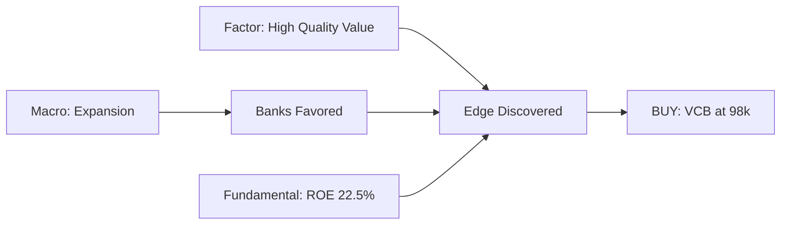
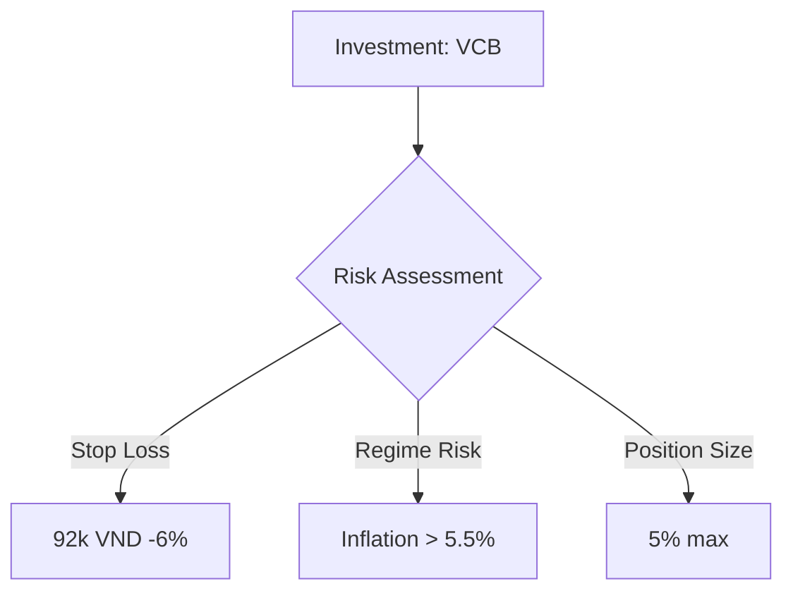

# vnstock Vietnamese Stock Market Research — Markdown Report Generation

## Quick Start

This workspace generates **markdown research reports** via multi-agent delegation.

**Core workflow**:

1. Main agent delegates to specialist sub-agents
2. Sub-agents **investigate** using notebookmd to capture their research process
3. Main agent **synthesizes discoveries** from all investigations
4. notebookmd captures artifacts (tables, charts) automatically during research

**Data access**:

```python
from vnstock_lib import fetch_quote, fetch_ratios, fetch_financial_data

# Example: Analyze VCB (Vietcombank)
prices = fetch_quote('VCB', start='2025-01-01', end='2026-02-20')
ratios = fetch_ratios('VCB', period='annual')
```

See `.claude/skills/vnstock-data/SKILL.md` for full API reference.

**notebookmd: Automate Report Formatting**

```python
# notebookmd captures your investigation process
from notebookmd import nb, NotebookConfig

cfg = NotebookConfig(
    max_table_rows=30,           # Show enough data for pattern recognition
    echo_to_console=True,        # Live investigation feedback
    include_code_default=False   # Hide code by default (focus on insights)
)
N = nb("analyses/VCB_2026-02-20/drafts/fundamentals/insights.md",
       title="Fundamental Investigation: VCB", cfg=cfg)

# Cells capture your investigation workflow
with N.cell("Hypothesis: VCB has exceptional ROE"):
    ratios = fetch_ratios('VCB')
    roe = ratios['roe'].values[0]
    N.kv({"ROE": f"{roe:.1f}%"})  # Auto-formatted key-value table

with N.cell("Question: Is high ROE from leverage or genuine profitability?"):
    # Investigate with ROIC calculation
    roic = calculate_roic(fetch_financials('VCB'))
    N.kv({
        "ROE": f"{roe:.1f}%",
        "ROIC": f"{roic:.1f}%",
        "Finding": "High ROIC confirms genuine profitability, not leverage"
    })

N.save()  # Auto-generates markdown with asset management
```

**First-time setup**:

```bash
bash setup.sh
```

## Core Capabilities

### Available Functions (vnstock_lib.py)

- **Price Data**: `fetch_quote()`, `fetch_price_board()`, `calculate_returns()`
- **Financials**: `fetch_balance_sheet()`, `fetch_income_statement()`, `fetch_cash_flow()`, `fetch_ratios()`
- **Market Data**: `list_symbols()` (by exchange, industry, group)

Full documentation: `.claude/skills/vnstock-data/vnstock_lib.py`

### Agent Mindset

**You are an autonomous researcher, not a script executor.**

Core workflow: **Plan → Gather → Decide → Iterate → Synthesize**

See `vnstock.en-US.md` for detailed agent mindset and philosophy.

## Multi-Agent Research Orchestration

When user requests comprehensive analysis, spawn specialist sub-agents in parallel.

### Available Sub-Agents

See `vnstock.en-US.md` for full table. Quick reference:

- **Macro** - Economic regime analysis
- **Fundamental** - Financial health (ROE, NPL, margins)
- **Factor** - Quantitative factors (value, momentum, quality)
- **Technical** - Price action and momentum
- **Valuation** - Intrinsic value estimation
- **Sentiment** - News and market psychology

### Orchestration Workflow

**Step 1: Create Workspace**

```bash
SYMBOL=VCB
TODAY=$(date +%Y-%m-%d)
ANALYSIS_DIR="analyses/${SYMBOL}_multiagent_${TODAY}"
# notebookmd auto-creates asset directories, just create draft directories
mkdir -p "$ANALYSIS_DIR/drafts"/{macro,fundamentals,factors,technicals,valuation,sentiment}
```

**Step 2: Spawn Agents in Parallel**

Use Task tool with `run_in_background=true`. **Critical**: All spawns in SINGLE message.

Example prompt for each agent:

````
You are the [Fundamental] Analyst for Vietnamese equities. Your job is **discovery**, not report writing.

**Investigation approach**:
1. Form hypothesis (e.g., "VCB has high ROE - is it quality or leverage?")
2. Gather data to test hypothesis
3. Discover what the data reveals (surprises? contradictions?)
4. Iterate: Ask follow-up questions based on findings
5. Capture your investigation using notebookmd (it handles formatting)

Example investigation workflow:
```python
from notebookmd import nb, NotebookConfig
from vnstock_lib import fetch_ratios, fetch_financials

cfg = NotebookConfig(max_table_rows=30, echo_to_console=True, include_code_default=True)
N = nb("drafts/fundamentals/insights.md", title="Fundamental Investigation: {symbol}", cfg=cfg)

with N.cell("Hypothesis: {symbol} has exceptional ROE"):
    ratios = fetch_ratios('{symbol}')
    roe = ratios['roe'].values[0]
    N.kv({"ROE": f"{roe:.1f}%"})
    print(f"Confirmed: ROE is {roe:.1f}%")

with N.cell("Question: Is high ROE from leverage or genuine profitability?"):
    # Calculate ROIC vs ROE spread
    financials = fetch_financials('{symbol}')
    roic = calculate_roic(financials)
    leverage = ratios['debt_to_equity'].values[0]
    N.kv({
        "ROE": f"{roe:.1f}%",
        "ROIC": f"{roic:.1f}%",
        "Leverage": f"{leverage:.1f}x",
        "Finding": "High ROIC confirms genuine profitability, not leverage game"
    })

with N.cell("Peer validation: Is {symbol} best-in-class?"):
    peers = fetch_ratios(['VCB', 'TCB', 'VPB', 'ACB'])
    N.table(peers[['ticker', 'roe', 'roa', 'npm']], name="Peer comparison")
    # Discovery: {symbol} is #1 by significant margin

with N.cell("Deep dive: Why is {symbol}'s ROE superior?"):
    # DuPont analysis: margin × turnover × leverage
    # Discover root causes (e.g., superior NIM, lower cost/income)
    pass

N.save()
```

**Focus**: Spend time on **analysis depth**, not markdown formatting. notebookmd handles the formatting.
````

**Step 3: Monitor Completion**

```bash
ls -la analyses/VCB_multiagent_2026-02-20/drafts/*/insights.md
```

**Step 4: Synthesize Investigations into Final Report**

Use notebookmd to synthesize discoveries from sub-agent investigations:

````python
from notebookmd import nb, NotebookConfig
from pathlib import Path

cfg = NotebookConfig(max_table_rows=30, echo_to_console=True, include_code_default=True)
N = nb("final_report.md", title="Investment Analysis: {symbol}", cfg=cfg)

with N.cell("Gather sub-agent discoveries"):
    # Read investigation notebooks
    macro_md = Path('drafts/macro/insights.md').read_text()
    fund_md = Path('drafts/fundamentals/insights.md').read_text()
    factor_md = Path('drafts/factors/insights.md').read_text()
    # Extract key discoveries (not just summaries)

with N.cell("Executive Summary"):
    N.md("**Macro**: Expansion regime favors banks...")
    N.kv({
        "Recommendation": "STRONG BUY",
        "Entry": "98k VND",
        "Target": "110k (+12%)",
        "Stop": "92k (-6%)"
    })

with N.cell("Triangulate: What do these discoveries reveal together?"):
    # Find non-obvious edges by combining insights
    # Example: Quality improvement underpriced + macro tailwind
    N.md("""
    **Synthesis**: Market sees VCB as expensive quality bank.
    **Reality**: Quality improved faster than price + macro tailwind just starting.
    **Edge**: Quality re-rating opportunity in favorable macro regime.
    """)

with N.cell("Investment Thesis"):
    # Use mermaid for thesis flow (N.md supports mermaid)
    N.md("""
```mermaid
graph LR
    A[Macro: Expansion] --> D[Edge: Quality Mispriced]
    B[Fund: ROE 22.5%] --> D
    C[Factor: Quality-Value] --> D
    D --> E[STRONG BUY]
````

    """)

N.save()

````

**Step 5: notebookmd API Reference**

Key emitters for data visualization:

```python
# Tables (auto-formatted DataFrames)
N.table(df, name="Peer comparison", max_rows=30)

# Key-value metrics (cleaner than manual markdown)
N.kv({"ROE": "22.5%", "P/B": "2.3x"}, title="Metrics")

# Figures (matplotlib/plotly with auto-save)
N.figure(fig, "chart.png", caption="Price trend")

# Raw markdown (for mermaid diagrams)
N.md("""
```mermaid
graph TD
    A --> B
````

""")

# CSV exports (data downloads)

N.export_csv(df, "data.csv", name="Full dataset")

````

## Agent Synthesis: Finding Market Edges

**Your job**: SYNTHESIZE (not just concatenate)

**Aggregation** (❌ Basic):

- Read each insight separately
- Concatenate all findings
- Present as bullet list

**Synthesis** (✅ Agent mindset):

- **Triangulate**: How do findings combine? What emerges from the intersection?
- **Find contradictions**: If macro favors momentum but stock is value, WHY?
- **Discover edges**: What non-obvious opportunity appears when insights combine?

**Example: VCB Investment Thesis**

**Inputs**:

- Macro: "EXPANSION regime, banks favored, credit growth 14.5%"
- Factor: "VCB value z-score +0.8 (cheap), quality z-score +1.5 (high)"
- Fundamental: "VCB ROE 22.5% vs sector 16%, NPL 0.8% vs sector 2.2%"
- Valuation: "Fair P/B 2.6x, current 2.3x → +13% upside"

**Your Synthesis**:

```markdown
# The Edge

Market underprices VCB quality in an expansion regime that favors banks.

# Why This is Non-Obvious

Most investors see VCB as "fairly valued" (P/B 2.3x vs sector 2.0x).
They miss:

1. Quality premium underpriced (22.5% ROE vs 16% justifies 40% higher P/B, not 15%)
2. Macro tailwind (expansion → loan growth → NIM expansion)
3. Factor anomaly (value usually = low quality; VCB = high-quality value)

# Conviction: HIGH

All 4 agents align (macro, factor, fundamental, valuation point to BUY).

# Risk Management

- Stop loss: 92k VND (below support at 95k)
- Regime risk: If CPI > 5.5%, SBV tightens → exit
- Position size: 5% (high conviction, not overconcentrated)

# Action

BUY VCB at 98k, target 110k (+12%), stop 92k (-6%)
Risk/reward: 2:1
````

**This is synthesis**: Finding edges by triangulating independent viewpoints.

## Vietnamese Market Essentials

See `vnstock.en-US.md` for full context. Quick reference:

**Exchanges**: HOSE (large-cap), HNX (mid-cap), UPCOM (unlisted)

**Key Indices**: VN30 (market bellwether), VNMidCap, VNSmallCap

**Major Symbols**:

- Banks: VCB, TCB, VPB, ACB
- Industrials: HPG (steel), GAS (energy)
- Real Estate: VHM, NVL
- Consumer: VNM, MSN

**Critical Disclaimers**:

1. Data may be incomplete/delayed - verify critical decisions
2. Rate limits: Guest 20 req/min, Community 60 req/min
3. Not for live trading - research only
4. Cross-check with official sources (company filings, exchange announcements)

## Markdown Report Best Practices

### Use Tables for Data Comparison

**Financial metrics comparison**:

```markdown
| Metric | VCB   | Peers | Interpretation    |
| ------ | ----- | ----- | ----------------- |
| ROE    | 22.5% | 16.0% | ✅ Best-in-class  |
| P/B    | 2.3x  | 2.0x  | ⚠️ Slight premium |
| NPL    | 0.8%  | 1.7%  | ✅ Strong quality |
```

**Factor z-scores**:

```markdown
| Factor    | VCB Z-Score | Interpretation  |
| --------- | ----------- | --------------- |
| Value     | +0.8        | Cheap           |
| Quality   | +1.5        | High quality    |
| Momentum  | -0.3        | Weak momentum   |
| Composite | +1.2        | 82nd percentile |
```

### Use Mermaid Diagrams for Insights

**Investment thesis flow**:

````markdown

````

**Risk factors**:

````markdown

````

### Final Report Structure (Cell-Based Approach)

Use notebookmd cells to capture the synthesis workflow:

1. **Gather sub-agent discoveries** - Read investigation notebooks, extract key findings
2. **Executive Summary** - Use N.kv() for recommendation, entry, target, stop
3. **Triangulate insights** - Find non-obvious edges from combined discoveries
4. **Investment Thesis** - Use N.md() with mermaid diagram for thesis flow
5. **Conviction drivers** - Use N.kv() for conviction scores across agents
6. **Risk Management** - Stop loss logic, position sizing, monitoring plan

**Cell structure reflects your synthesis process**, not a rigid template. Focus on discovering edges by triangulating independent agent discoveries.
