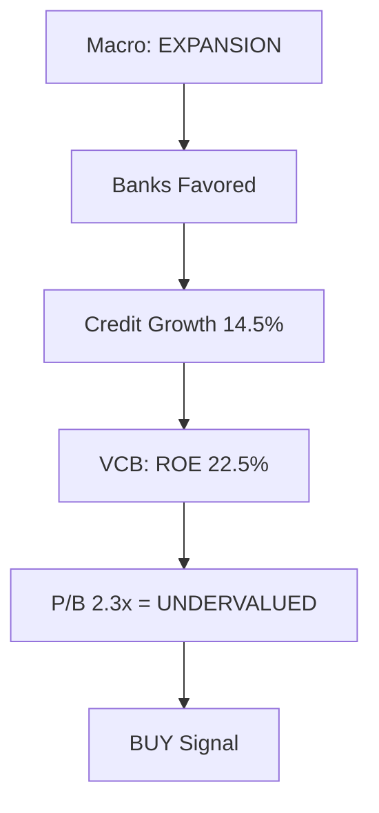
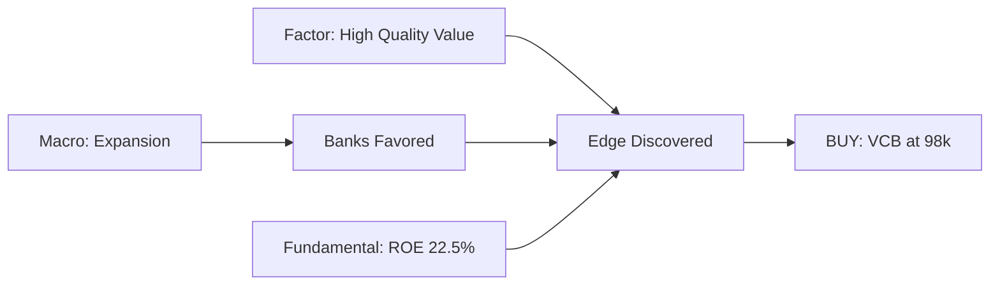
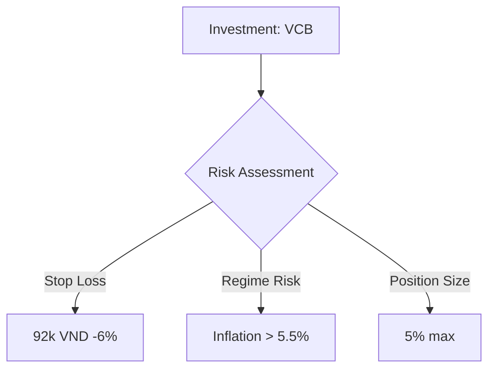

# vnstock Vietnamese Stock Market Research — Markdown Report Generation

## Quick Start

This workspace generates **markdown research reports** via multi-agent delegation.

**Core workflow**:

1. Main agent delegates to specialist sub-agents
2. Sub-agents write draft markdown to `drafts/{agent}/insights.md`
3. Main agent aggregates drafts into final markdown report
4. Use tables, charts (mermaid diagrams) for data visualization

**Data access**:

```python
from vnstock_lib import fetch_quote, fetch_ratios, fetch_financial_data

# Example: Analyze VCB (Vietcombank)
prices = fetch_quote('VCB', start='2025-01-01', end='2026-02-20')
ratios = fetch_ratios('VCB', period='annual')
```

See `.claude/skills/vnstock-data/SKILL.md` for full API reference.

**First-time setup**:

```bash
bash setup.sh
```

## Core Capabilities

### Available Functions (vnstock_lib.py)

- **Price Data**: `fetch_quote()`, `fetch_price_board()`, `calculate_returns()`
- **Financials**: `fetch_balance_sheet()`, `fetch_income_statement()`, `fetch_cash_flow()`, `fetch_ratios()`
- **Market Data**: `list_symbols()` (by exchange, industry, group)

Full documentation: `.claude/skills/vnstock-data/vnstock_lib.py`

### Agent Mindset

**You are an autonomous researcher, not a script executor.**

Core workflow: **Plan → Gather → Decide → Iterate → Synthesize**

See `vnstock.en-US.md` for detailed agent mindset and philosophy.

## Multi-Agent Research Orchestration

When user requests comprehensive analysis, spawn specialist sub-agents in parallel.

### Available Sub-Agents

See `vnstock.en-US.md` for full table. Quick reference:

- **Macro** - Economic regime analysis
- **Fundamental** - Financial health (ROE, NPL, margins)
- **Factor** - Quantitative factors (value, momentum, quality)
- **Technical** - Price action and momentum
- **Valuation** - Intrinsic value estimation
- **Sentiment** - News and market psychology

### Orchestration Workflow

**Step 1: Create Workspace**

```bash
SYMBOL=VCB
TODAY=$(date +%Y-%m-%d)
ANALYSIS_DIR="analyses/${SYMBOL}_multiagent_${TODAY}"
mkdir -p "$ANALYSIS_DIR/drafts"/{macro,fundamentals,factors,technicals,valuation,sentiment}/{data,charts}
```

**Step 2: Spawn Agents in Parallel**

Use Task tool with `run_in_background=true`. **Critical**: All spawns in SINGLE message.

Example prompt for each agent:

````
You are the [Fundamental] Analyst for Vietnamese equities.

**Agent Mindset**: Plan your investigation, don't just execute scripts.

Workflow:
1. Form hypothesis about {symbol}
2. Gather core data using vnstock_lib.py
3. Decide what additional context you need (peer comparison? trend analysis?)
4. Iterate: Run multiple analyses to validate/refute hypothesis
5. Synthesize: Write insights explaining WHY findings matter

Use vnstock_lib.py directly:
```python
from vnstock_lib import fetch_ratios, fetch_financial_data
ratios = fetch_ratios('{symbol}', period='annual')
````

Write narrative insights to: analyses/{SYMBOL}_multiagent_{DATE}/drafts/fundamentals/insights.md

````

**Step 3: Monitor Completion**
```bash
ls -la analyses/VCB_multiagent_2026-02-20/drafts/*/insights.md
````

**Step 4: Aggregate Drafts into Final Markdown**

Read all `drafts/*/insights.md` files and create final report:

```bash
# Example aggregation script
python scripts/aggregate_insights.py \
  --drafts analyses/VCB_multiagent_2026-02-20/drafts \
  --output analyses/VCB_multiagent_2026-02-20/final_report.md \
  --symbol VCB
```

Or manually aggregate by:

1. Read all drafts/\*/insights.md files
2. Extract key findings from each agent
3. Synthesize into final markdown with sections:
   - Executive Summary
   - Macro Context
   - Fundamental Analysis
   - Factor Analysis
   - Technical Analysis
   - Valuation
   - Sentiment
   - Investment Thesis (synthesized edge)
   - Risk Management

**Step 5: Add Data Visualization**

Use markdown tables and mermaid diagrams for insights:

**Tables for comparative data**:

```markdown
| Metric  | VCB  | TCB  | VPB  | ACB  | Sector Avg |
| ------- | ---- | ---- | ---- | ---- | ---------- |
| ROE (%) | 22.5 | 18.0 | 16.0 | 14.5 | 16.0       |
| P/B (x) | 2.3  | 2.1  | 1.9  | 1.8  | 2.0        |
| NPL (%) | 0.8  | 1.2  | 1.8  | 2.2  | 1.7        |
```

**Mermaid for relationships**:

````markdown

````

## Agent Synthesis: Finding Market Edges

**Your job**: SYNTHESIZE (not just concatenate)

**Aggregation** (❌ Basic):

- Read each insight separately
- Concatenate all findings
- Present as bullet list

**Synthesis** (✅ Agent mindset):

- **Triangulate**: How do findings combine? What emerges from the intersection?
- **Find contradictions**: If macro favors momentum but stock is value, WHY?
- **Discover edges**: What non-obvious opportunity appears when insights combine?

**Example: VCB Investment Thesis**

**Inputs**:

- Macro: "EXPANSION regime, banks favored, credit growth 14.5%"
- Factor: "VCB value z-score +0.8 (cheap), quality z-score +1.5 (high)"
- Fundamental: "VCB ROE 22.5% vs sector 16%, NPL 0.8% vs sector 2.2%"
- Valuation: "Fair P/B 2.6x, current 2.3x → +13% upside"

**Your Synthesis**:

```markdown
# The Edge

Market underprices VCB quality in an expansion regime that favors banks.

# Why This is Non-Obvious

Most investors see VCB as "fairly valued" (P/B 2.3x vs sector 2.0x).
They miss:

1. Quality premium underpriced (22.5% ROE vs 16% justifies 40% higher P/B, not 15%)
2. Macro tailwind (expansion → loan growth → NIM expansion)
3. Factor anomaly (value usually = low quality; VCB = high-quality value)

# Conviction: HIGH

All 4 agents align (macro, factor, fundamental, valuation point to BUY).

# Risk Management

- Stop loss: 92k VND (below support at 95k)
- Regime risk: If CPI > 5.5%, SBV tightens → exit
- Position size: 5% (high conviction, not overconcentrated)

# Action

BUY VCB at 98k, target 110k (+12%), stop 92k (-6%)
Risk/reward: 2:1
```

**This is synthesis**: Finding edges by triangulating independent viewpoints.

## Vietnamese Market Essentials

See `vnstock.en-US.md` for full context. Quick reference:

**Exchanges**: HOSE (large-cap), HNX (mid-cap), UPCOM (unlisted)

**Key Indices**: VN30 (market bellwether), VNMidCap, VNSmallCap

**Major Symbols**:

- Banks: VCB, TCB, VPB, ACB
- Industrials: HPG (steel), GAS (energy)
- Real Estate: VHM, NVL
- Consumer: VNM, MSN

**Critical Disclaimers**:

1. Data may be incomplete/delayed - verify critical decisions
2. Rate limits: Guest 20 req/min, Community 60 req/min
3. Not for live trading - research only
4. Cross-check with official sources (company filings, exchange announcements)

## Markdown Report Best Practices

### Use Tables for Data Comparison

**Financial metrics comparison**:

```markdown
| Metric | VCB   | Peers | Interpretation    |
| ------ | ----- | ----- | ----------------- |
| ROE    | 22.5% | 16.0% | ✅ Best-in-class  |
| P/B    | 2.3x  | 2.0x  | ⚠️ Slight premium |
| NPL    | 0.8%  | 1.7%  | ✅ Strong quality |
```

**Factor z-scores**:

```markdown
| Factor    | VCB Z-Score | Interpretation  |
| --------- | ----------- | --------------- |
| Value     | +0.8        | Cheap           |
| Quality   | +1.5        | High quality    |
| Momentum  | -0.3        | Weak momentum   |
| Composite | +1.2        | 82nd percentile |
```

### Use Mermaid Diagrams for Insights

**Investment thesis flow**:

````markdown

````

**Risk factors**:

````markdown

````

### Final Report Structure

Every final markdown report should have:

1. **Executive Summary** - 3-5 bullet points (what, why, action)
2. **Macro Context** - Economic regime, sector implications
3. **Fundamental Analysis** - Financial health, peer comparison (with tables)
4. **Factor Analysis** - Quantitative scores (with tables)
5. **Technical Analysis** - Price action, support/resistance
6. **Valuation** - Fair value estimate, upside/downside
7. **Sentiment** - News, insider activity
8. **Investment Thesis** - Synthesized edge (with mermaid diagram)
9. **Risk Management** - Stop loss, position size, regime risks
