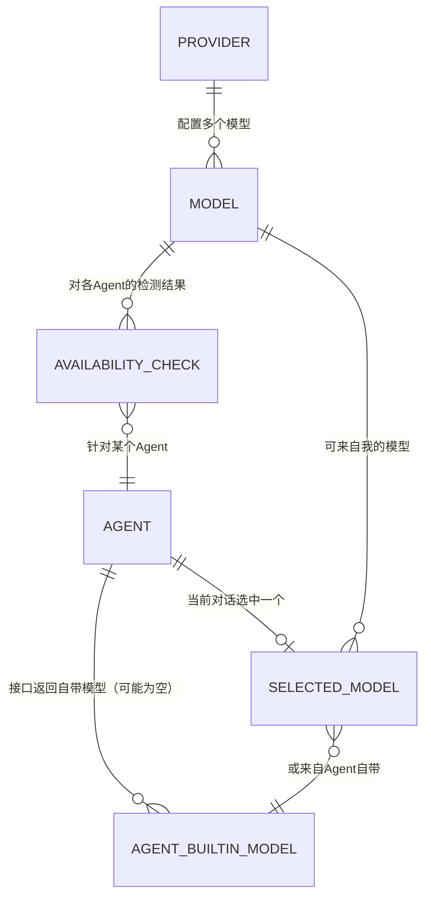

# 自定义模型跨 Agent 切换

> 让用户在 AionUi 里**配置好自己的大模型（一套 Provider 设置）后，能在各个 CLI Agent（如 Claude Code、Codex）的模型下拉里直接选到、并真正用上**，不必再借助外部工具。
>
> 本篇为单功能 PRD，配套线框图见 [wireframe.html](./wireframe.html)。

---

## 一、要解决的问题

AionUi 是一个能在一个界面里切换多个 CLI Agent（如 Claude Code、Codex、Gemini CLI，多数通过 ACP 协议接入）来干活的桌面工作端。

> 名词约定：
>
> - **CLI Agent**：外部命令行智能体，如 Claude Code、Codex。AionUi 把它们接进来，用户在同一个界面里切换使用。
> - **ACP**：这些 Agent 接入 AionUi 所用的一套协议。用户不需要感知，只需知道「这类 Agent 是外部接进来的」。
> - **Provider（模型供应商）**：AionUi「设置 → 模型」里配置的一组连接信息——名称、服务地址（Base URL）、密钥（API Key）、以及这组连接下可用的模型列表。一个 Provider 下可以有多个模型。

今天的现状是**割裂的**：

- 用户可以在 AionUi 的设置里配好自己的大模型（Provider），但**这些模型只有 AionUi 内置的引擎能用**。
- 当用户切到 Claude Code、Codex 这类 CLI Agent 时，模型下拉里出现的，**只有这个 Agent 自己内部配好的模型**，用户在 AionUi 里配的模型进不了这个下拉，选不了、也用不上。

结果是：用户想让 Claude Code 用自己那套大模型，AionUi 帮不上忙。用户的常见办法是**另外下载一个叫 CC Switch 的小工具**，在里面配好模型，再回到 AionUi 里用。等于「配置在 AionUi 外面，AionUi 只是个壳」。

**我们要做的**：把「配一次模型、各个 Agent 都能用」这件事直接做进 AionUi——用户在 AionUi 设置里配好的 Provider 模型，能出现在 CLI Agent 的模型下拉里，选中即用。

## 二、目标

- 用户在 AionUi「设置 → 模型」里配好的 Provider 模型，能出现在 CLI Agent（首期 Claude Code、Codex）的模型下拉中。
- 用户在下拉里选一个自己的模型，该 Agent 后续对话就用这个模型工作。
- **复用现有的 Provider 设置**，不新开一套「给 Agent 用的模型」配置——配一次，处处可用。
- 模型下拉能让用户一眼分清：哪些是 **Agent 自带的模型**，哪些是**我自己配的模型**。
- 用户能主动**检测**一个自定义模型在各个 Agent 上是否真的能跑通，并在模型列表里一眼看到「哪些 Agent 能用它」——避免选了却用不了。

## 三、本期不做（Non-Goals）

| 不做的事 | 原因 / 说明 |
| --- | --- |
| 新建一套「给 CLI Agent 用」的模型配置 | 明确复用现有 Provider 设置，不做第二套 |
| 改造「设置 → 模型」里 Provider 的基础配置字段（名称 / 地址 / 密钥） | 配置入口已存在且够用；本期只在此基础上**增加「可用性检测」相关的呈现**，不动原有字段 |
| 后台自动、静默地检测所有模型的可用性 | 检测有成本（要真跑一次），本期只做**用户主动触发**的检测 |
| 覆盖 Claude Code、Codex 以外的 Agent | 首期对齐 CC Switch 已明确支持的两个；其余见「待讨论模块」 |
| 内置引擎（AionCLI）的模型下拉逻辑重构 | 它本来就在用「我的模型」，本功能会把它统一进同一套下拉模式，但不改其既有行为 |

## 四、核心概念

### 概念一：两类模型，来源不同

任何一个 Agent 的模型下拉，最多由两类模型组成。讲清它们的来源，是这个功能能不能被用户看懂的关键：

| 类别 | 从哪来 | 举例 |
| --- | --- | --- |
| **Agent 自带模型** | Agent 通过接口报给 AionUi 的、它自己内部配好的模型。这是**现状**，本期保留。 | Claude Code 报上来的 Claude Opus / Sonnet / Haiku |
| **我的模型** | 用户在 AionUi「设置 → 模型」里配的 Provider 模型。这是**本期新增**进下拉的部分。 | 用户自己配的某家供应商的 `deepseek-v4-pro`、`glm-5.1x` 等 |

> 用户视角的一句话：「下拉上半截是这个 Agent 自己带的，下半截是我自己配的。」

### 概念二：一套下拉逻辑，覆盖所有 Agent（含内置 AionCLI）

上面两类模型不是「两种下拉」，而是**同一套下拉逻辑的两个区**，只是不同 Agent 各区有没有内容不同：

| Agent 情况 | 【Agent 自带】区 | 【我的模型】区 | 下拉呈现 |
| --- | --- | --- | --- |
| **内置 AionCLI** | 无自带模型 → 该区隐藏 | 有（用户配置的 Provider 模型） | 只显示「我的模型」一个区 |
| **Claude Code / Codex 等外部 Agent** | 有（接口返回） | 有（用户配置的 Provider 模型） | 显示「Agent 自带」+「我的模型」两个区 |

> 规则：**某个区没有内容就整块隐藏，不留空标题。** 内置 AionCLI 只是「上区天然为空」的那个特例——它验证了这套逻辑是统一的一套，不是给外部 Agent 单独写的。

> 商业化前瞻（非本期功能，仅说明这套结构为何这样设计）：未来 AionUi 若内置一批需付费使用的官方模型，那批模型将归入某个 Agent 的**【Agent 自带】区**（相当于「官方替你配好、你付费即用」）。届时内置 AionCLI 的上区就不再为空。本期结构已能容纳这种演进，无需为它改版。

### 概念三：我们借鉴 CC Switch，但做得更进一步

CC Switch 切换的是**「一整套连接配置」**——切到哪个服务地址、用哪个密钥，而**不是某一个具体模型**：它切一套连接给 Claude Code，具体用哪个模型仍由 Claude Code 那端决定。

AionUi 的 Provider 设置里，本来就带**明确的模型列表**（一个 Provider 下有哪些模型是清清楚楚的）。所以我们可以做到 CC Switch 做不到的一步：**让用户在下拉里直接点选一个具体的自定义模型**，而不只是切一套连接。

> 这条是「借鉴它的能力，但因为我们有更完整的模型信息，能给用户更直接的选择」。判断某个 Agent 能不能支持、以何种形式支持，遵循「**CC Switch 支持的，我们就先看能不能支持**」——首期锁定它已明确支持的 Claude Code 与 Codex。

### 概念四：配一次，多 Agent 复用

用户不需要为每个 Agent 分别配模型。**在「设置 → 模型」配好的一个 Provider，其模型对所有支持本功能的 Agent 都可见**。用户在某个 Agent 的下拉里选中「我的模型」中的一个，只影响当前这个 Agent 当前的对话，不改动 Provider 配置本身。

### 概念五：可用性是「验证过的」，不是「猜的」

一个自定义模型能不能在某个 Agent 上跑通，取决于协议是否兼容等因素——**光看配置猜不准**（有的看着不兼容却能跑，有的看着行却因密钥 / 网络失败）。所以本功能不去「猜兼容性并自动过滤」，而是：

- 让用户在模型列表里**主动发起检测**——实质是「拿这个模型、通过选定的 Agent 真跑一次」，用真实结果说话。
- 检测通过后，在该模型旁**显示能用它的 Agent 图标**，让用户一眼看到「这个模型 Claude Code 能用、Codex 能用」。

> 一个重要限定：图标代表的是「**最近一次检测通过**」，不是「永远可用」。密钥会过期、服务会临时不可达，所以检测结果是一张**可随时重测的快照**，而非终身保证。产品呈现上不能让用户误以为「检测过 = 一定能用」。

## 五、功能需求

> 功能编号：`F-MODEL-NN`，MODEL = 自定义模型跨 Agent 切换。编号仅作引用，不含优先级。

### F-MODEL-01 CLI Agent 下拉中展示「我的模型」

**现状**：CLI Agent 的模型下拉只显示 Agent 自带模型（接口返回）。用户在 AionUi 配的 Provider 模型不出现在这里。

**需求**：在 CLI Agent 的模型下拉里，**在保留 Agent 自带模型的基础上，追加展示用户配置的 Provider 模型**。

- 下拉分成两个区：
  - **上区【Agent 自带】**：Agent 接口返回的模型，平铺展示，与现状一致。
  - **下区【我的模型】**：用户配置的 Provider 模型，**按 Provider 名分组**（与内置引擎下拉的分组风格一致）。
- 「我的模型」下区只展示用户已启用的模型（沿用 Provider 设置里已有的「模型启用 / 停用」状态）。
- 当前选中的模型，无论落在哪个区，都以勾选 / 高亮明确标出。

**正常流程**：
1. 用户在 CLI Agent 的对话里点开模型下拉。
2. 看到两个分区：上面是这个 Agent 自带的模型，下面是自己配的模型（按 Provider 分组）。
3. 找到并识别出想用的那一个。

**异常情况**：
- 用户**没配任何 Provider**：下拉只显示【Agent 自带】区，不显示空的「我的模型」区（或给一句「去设置里添加模型」的引导，具体表现交由体验细化）。
- 用户配了 Provider 但**全部模型都被停用**：同上，不显示空的「我的模型」区。
- Agent **自带模型拉取失败 / 为空**：至少「我的模型」区仍可正常展示可选（不因自带模型缺失而整个下拉不可用）。

**验收**：
- [ ] CLI Agent 下拉在自带模型之外，追加显示用户配置的 Provider 模型
- [ ] 两类模型分区展示：【Agent 自带】平铺、【我的模型】按 Provider 分组
- [ ] 「我的模型」只列出已启用的模型
- [ ] 当前选中模型在下拉中有明确标识
- [ ] 未配 Provider / 模型全停用时，不出现空的「我的模型」区

---

### F-MODEL-02 选中「我的模型」后，该 Agent 用它工作

**现状**：CLI Agent 只能用自带模型工作。

**需求**：用户在下拉里选中「我的模型」中的一个后，**当前这个 Agent 的后续对话即改用该模型**，效果与选择自带模型一致——用户不需要感知底层差异。

- 选中后，下拉按钮上显示的当前模型名更新为所选模型。
- 切换只作用于**当前 Agent 的当前对话**，不影响其他 Agent、不改动 Provider 配置。
- 选择「我的模型」和选择「Agent 自带模型」之间可以来回切换。

**正常流程**：
1. 用户在下拉「我的模型」区点选一个模型。
2. 下拉关闭，当前模型显示更新为该模型。
3. 之后在该 Agent 的对话中发消息，由所选模型来回答。

**异常情况**：
- 所选模型**当前不可用**（如密钥失效、服务不可达）：给出可感知的失败提示，不静默失败（具体表现交由技术处理）。
- 切换**未即时生效**（部分 Agent 的生效时机可能不同）：见「待讨论模块」关于生效时机的说明。

**验收**：
- [ ] 选中「我的模型」后，当前 Agent 的对话使用该模型工作
- [ ] 当前模型显示同步更新
- [ ] 切换只影响当前 Agent 当前对话，不影响其他 Agent、不改 Provider 配置
- [ ] 可在「我的模型」与「Agent 自带」之间来回切换
- [ ] 所选模型不可用时有可感知的失败提示

> 技术确认项（影响产品可行性，非实现方案）：
> - 每个 Agent 接收模型配置的方式不同（Claude Code 与 Codex 各有各的机制），「一套 Provider 通吃」在体验上成立，但底层需针对每个 Agent 分别对接——**这决定了首期能落地几个 Agent**。请工程确认 Claude Code、Codex 两者均可行。
> - 需确认某个自定义模型被选中后，其**生效时机**（立即生效 / 需新开对话 / 需重启该 Agent），以便决定异常情况里怎么提示用户。

---

### F-MODEL-03 模型可用性检测：用户主动测、图标标结果

**现状**：用户配好一个模型后，无法预先知道它在哪个 Agent 上能跑通，只能选了之后碰运气。

**需求**：在「设置 → 模型」的模型列表里，为每个模型提供**主动发起的可用性检测**；检测通过的 Agent，在该模型旁以 **Agent 图标**标出，让用户直观看到「哪些 Agent 能用这个模型」。

- 每个模型有一个**检测入口**（如按钮）。触发后可选择：
  - 针对**某一个** Agent 检测；或
  - **一次性对多个** Agent 批量检测。
- 检测实质是「拿这个模型、通过所选 Agent 真跑一次」（具体方式交由技术处理），过程中给出进行中 / 成功 / 失败的可感知状态。
- 检测**通过**的 Agent，其图标显示在该模型旁；未通过 / 未检测的不显示（或以灰态区分，具体表现交由体验细化）。
- 图标含义是「**最近一次检测通过**」，用户可**随时重新检测**刷新结果（见核心概念·可用性是验证过的）。

**正常流程**：
1. 用户在模型列表某个模型上点「检测」。
2. 选择要检测的 Agent（单个或多选）。
3. 系统逐个跑通检测，实时反馈每个 Agent 的结果。
4. 通过的 Agent 图标点亮在该模型旁。

**异常情况**：
- 某个 Agent 检测失败：明确标出该 Agent 未通过，不影响其他 Agent 的结果。
- 检测耗时较长：给出进行中状态，不让用户以为卡死（是否可取消，见「待讨论模块」）。
- 用户改了 Provider 的地址 / 密钥：既有检测结果可能已过期——是否自动置为「待重测」，见「待讨论模块」。

**验收**：
- [ ] 模型列表中每个模型有主动检测入口
- [ ] 检测可选择单个 Agent 或批量多个 Agent
- [ ] 检测过程有进行中 / 成功 / 失败的可感知反馈
- [ ] 检测通过的 Agent 以图标标在该模型旁
- [ ] 支持随时重新检测，刷新图标结果

> 技术确认项（影响产品可行性，非实现方案）：
> - 「真跑一次」的检测会消耗时间与额度，需确认对每个 Agent（Claude Code / Codex）都能以较低成本发起一次最小化的可用性验证。
> - 检测结果的保存与失效口径（改了密钥是否失效、结果保存多久）需工程与体验共同确认。

---

## 六、实体关系

- 一个 Provider 下配置多个模型；用户可配置多个 Provider（现状已支持）。
- 一个 Agent 通过接口带来若干自带模型——**内置 AionCLI 该项为空**，外部 Agent 通常非空。
- 一个 Agent 的当前对话，选中一个模型——它可能来自「我的模型」（Provider 模型），也可能来自「Agent 自带」。
- 一个「我的模型」对不同 Agent 各有一份可用性检测结果（最近一次检测是否通过）。
- 「我的模型」是把已存在的 Provider 配置，暴露到 Agent 的使用侧，无需新建配置。

---

## 七、待讨论模块

以下问题尚未定论，先列出取舍，不在本期承诺：

1. **下拉里是否用检测结果给「我的模型」做提示**。
   已确定的方向是「不猜兼容性、不自动过滤，而是让用户主动检测（F-MODEL-03）」。延伸问题：CLI Agent 的下拉里选模型时，要不要把 F-MODEL-03 的检测结果用上——例如给「本 Agent 已检测通过」的模型加个标记，或把「未检测 / 检测失败」的模型灰态提示？
   - 倾向：下拉先如实全量展示「我的模型」，检测结果的标记作为增强项，视 F-MODEL-03 落地情况再叠加，避免两处逻辑耦合过紧。

2. **首期覆盖的 Agent 范围**。
   原则是「CC Switch 支持的，我们先看能不能支持」。CC Switch 目前明确支持 Claude Code、Codex（及 Gemini CLI 等更多工具）。首期先锁定 Claude Code、Codex 两个；Gemini CLI 等是否纳入，取决于工程对接成本，待评估。

3. **自定义模型选中后的生效时机与提示**。
   若某些 Agent 切换模型后不能即时生效（需新开对话或重启该 Agent），需要一个统一的用户提示口径。生效时机以工程确认为准，再定提示文案与形态。

4. **检测结果的失效与刷新策略**。
   用户改了 Provider 的地址 / 密钥后，旧的检测结果是否自动置为「待重测」？检测进行中能否取消？结果保存多久？这些既影响体验也影响成本，待工程与体验共同确认。

5. **同名 / 重复模型的呈现**。
   用户配置的模型可能与 Agent 自带模型重名（如都叫某个 Claude 模型）。下拉里是否去重、还是分区各自显示、如何避免用户混淆，待体验细化。
