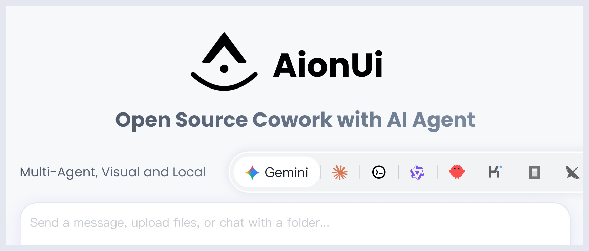
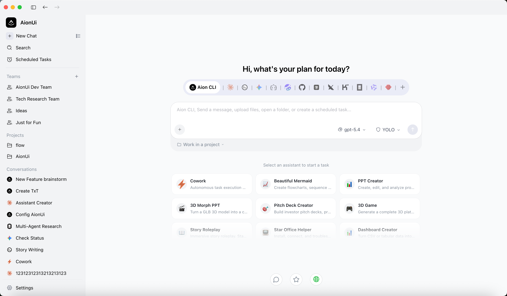
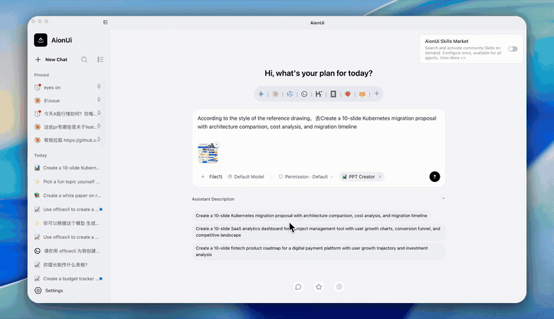
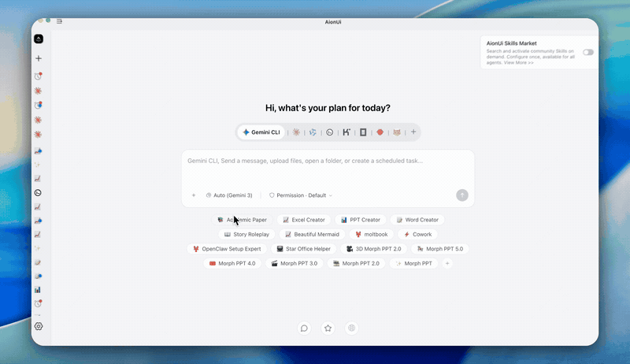
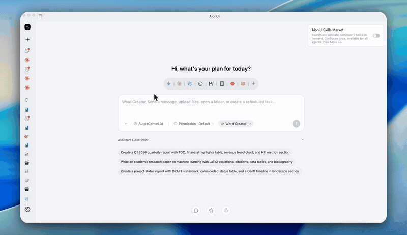
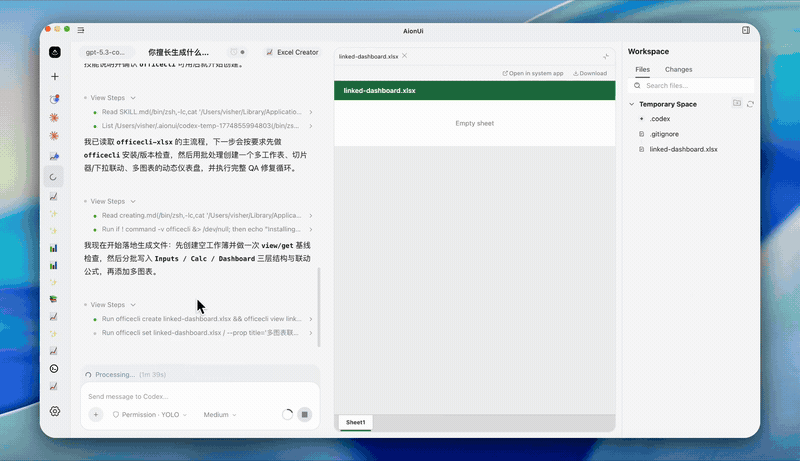
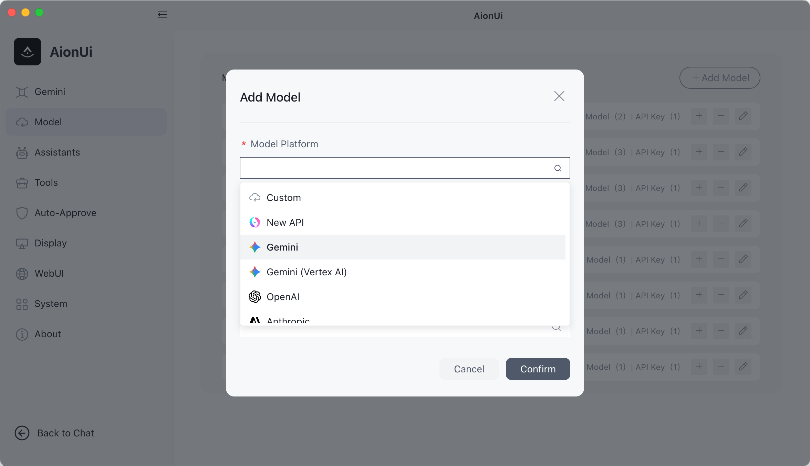
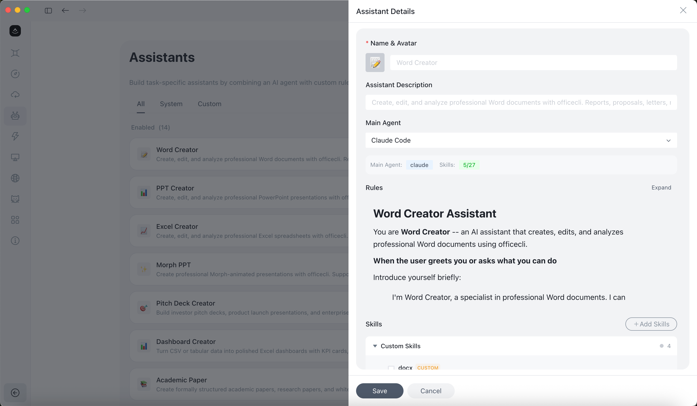
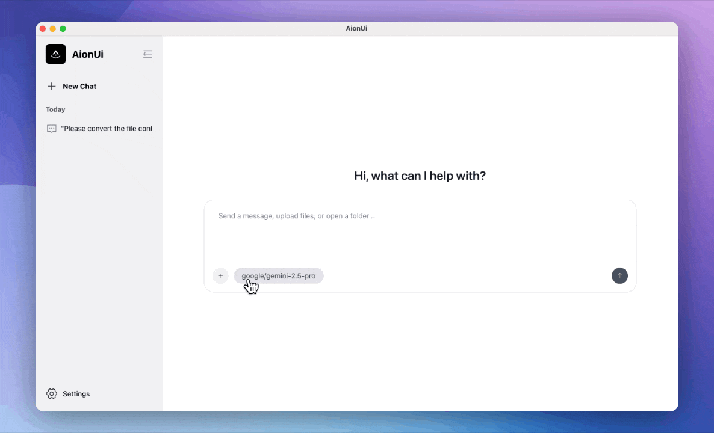
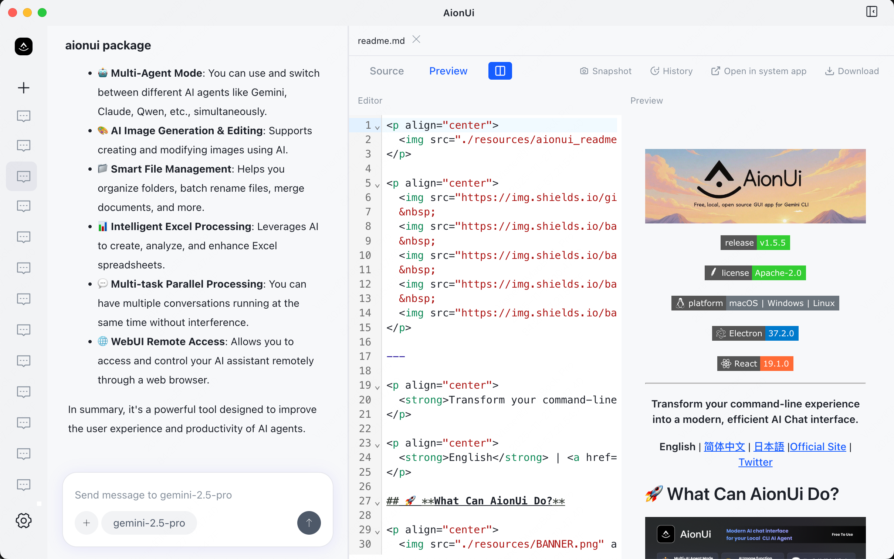

<p align="center">
  
</p>

<p align="center">
  
  &nbsp;
  
  &nbsp;
  
</p>

<p align="center">
  <a href="https://trendshift.io/repositories/15423" target="_blank">
    
  </a>
</p>

---

<p align="center">
  <strong>Eine kostenlose, quelloffene Cowork-App mit KI-Agenten</strong><br>
  <em>Eingebauter Agent | Null Konfiguration | Beliebiger API Key | Multi-Agenten | Fernzugriff | Plattformübergreifend | 24/7-Automatisierung</em>
</p>

<p align="center">
  <a href="https://github.com/iOfficeAI/AionUi/releases">
    
  </a>
</p>

<p align="center">
  <a href="../../readme.md">English</a> | <a href="./readme_ch.md">简体中文</a> | <a href="./readme_tw.md">繁體中文</a> | <a href="./readme_jp.md">日本語</a> | <a href="./readme_ko.md">한국어</a> | <a href="./readme_es.md">Español</a> | <a href="./readme_pt.md">Português</a> | <a href="./readme_tr.md">Türkçe</a> | <a href="./readme_ru.md">Русский</a> | <a href="./readme_uk.md">Українська</a> | <strong>Deutsch</strong> | <a href="https://www.aionui.com" target="_blank">Offizielle Website</a>
</p>

<p align="center">
  <strong>💬 Community:</strong> <a href="https://discord.gg/2QAwJn7Egx" target="_blank">Discord (Englisch)</a> | <a href="../../resources/wx-7.png" target="_blank">微信 (Chinesische Gruppe)</a> | <a href="https://twitter.com/AionUI" target="_blank">Twitter</a>
</p>

---

## 📋 Schnellnavigation

<p align="center">

[Cowork in Aktion](#-cowork-in-aktion) ·
[Warum AionUi?](#-warum-aionui-statt-claude-cowork) ·
[Schnellstart](#-schnellstart) ·
[Community](#-community--support)

</p>

---

## Cowork — KI-Agenten, die mit dir arbeiten

**AionUi ist mehr als ein Chat-Client.** Es ist eine Cowork-Plattform, auf der KI-Agenten direkt auf deinem Computer mit dir zusammenarbeiten — Dateien lesen, Code schreiben, im Web suchen und Aufgaben automatisieren. Du siehst alles, was der Agent tut, und behältst jederzeit die Kontrolle.

|                                        | Herkömmliche KI-Chat-Clients | **AionUi (Cowork)**                                                                                                                          |
| :------------------------------------- | :--------------------------- | :------------------------------------------------------------------------------------------------------------------------------------------- |
| KI kann mit deinen Dateien arbeiten    | Eingeschränkt oder nein      | **Ja — eingebauter Agent mit vollem Dateizugriff**                                                                                           |
| KI kann mehrstufige Aufgaben ausführen | Eingeschränkt                | **Ja — autonom mit deiner Genehmigung**                                                                                                      |
| Fernzugriff vom Smartphone             | Selten                       | **WebUI + Telegram / Lark / DingTalk / WeChat / WeCom**                                                                                      |
| Zeitgesteuerte Automatisierung         | Nein                         | **Cron — 24/7 unbeaufsichtigt**                                                                                                              |
| Mehrere KI-Agenten gleichzeitig        | Nein                         | **Claude Code, Codex, Qwen Code, Kiro, Hermes Agent, Snow CLI, Cursor Agent und 16+ weitere — automatisch erkannt, einheitliche Oberfläche** |
| Preis                                  | Kostenlos / Kostenpflichtig  | **Kostenlos & Open Source**                                                                                                                  |

<p align="center">
  
</p>

---

## Eingebauter Agent — Installieren und loslegen, null Konfiguration

AionUi enthält eine vollständige KI-Agent-Engine. Anders als Tools, bei denen du CLI-Agenten separat installieren musst, **funktioniert AionUi sofort nach der Installation**.

- **Keine CLI-Tools nötig** — die Agent-Engine ist bereits eingebaut
- **Kein komplexes Setup** — mit Google anmelden oder beliebigen API Key eingeben
- **Volle Agent-Fähigkeiten** — Dateien lesen/schreiben, Websuche, Bildgenerierung, MCP-Tools (Model Context Protocol)
- **Sofort einsatzbereite Assistenten** — 20 eingebaute professionelle Assistenten (Cowork, PPT Creator, Word Creator, Excel Creator, Morph PPT 3D, Pitch Deck Creator, Dashboard Creator, Akademischer Paper Writer, Financial Model Creator und mehr)

<p align="center">
  
</p>

### **Office-Assistenten — PPT, Word & Excel**

Diese Assistenten entsprechen den tatsächlich mitgelieferten Features: **Morph PPT**-Vorlagen und die **`pptx` / `docx` / `xlsx`-Skills** (siehe `assistant/` und `skills/` im Repository). Das eingebaute **[OfficeCLI](https://github.com/iOfficeAI/OfficeCli)** von AionUi macht PPT (Morph), Word (`.docx`) und Excel (`.xlsx/.xlsm/.csv`) schneller und zuverlässiger — von der Anfrage bis zum fertigen Dokument.

#### **PPT-Assistent**

> **Ausgabe:** bearbeitbare Morph-PPT (`.pptx`)
> Morph-animierte Folienübergänge mit konsistentem Erzählfluss; unterstützt von [OfficeCLI](https://github.com/iOfficeAI/OfficeCli).

<table>
  <tr>
    <td align="center" width="50%">
      
    </td>
    <td align="center" width="50%">
      
    </td>
  </tr>
</table>

#### **Word-Assistent**

> **Ausgabe:** bearbeitbares Word-Dokument (`.docx`)
> Wissenschaftliche Texte und produktionsreife Dokumentenbearbeitung via `docx`-Skill; unterstützt von [OfficeCLI](https://github.com/iOfficeAI/OfficeCli).

<table>
  <tr>
    <td align="center" width="50%">
      
    </td>
    <td align="center" width="50%">
      
    </td>
  </tr>
</table>

#### **Excel-Assistent**

> **Ausgabe:** nutzbare Excel-Datei (`.xlsx/.xlsm/.csv`)
> Tabellen generieren/aktualisieren mit `xlsx` für Analysen, Auto-Formatierung und Diagramme; unterstützt von [OfficeCLI](https://github.com/iOfficeAI/OfficeCli).

<table>
  <tr>
    <td align="center" width="50%">
      
    </td>
    <td align="center" width="50%">
      
    </td>
  </tr>
</table>

---

## Multi-Agenten-Modus — Hast du schon CLI-Agenten? Bring sie mit!

Wenn du bereits Claude Code, Codex oder Qwen Code nutzt, erkennt AionUi sie automatisch und lässt dich mit allen gleichzeitig arbeiten — zusammen mit dem eingebauten Agenten.

**Unterstützte Agenten:** Eingebauter Agent (null Setup) • Claude Code • Codex • Qwen Code • Goose AI • OpenClaw • Augment Code • CodeBuddy • Kimi CLI • OpenCode • Factory Droid • GitHub Copilot • Qoder CLI • Mistral Vibe • Nanobot • Aion CLI (aionrs, der in Rust geschriebene Backend-Service von AionUi) • Snow CLI • Kiro • Hermes Agent • Cursor Agent und mehr

<p align="center">
  
</p>

- **Automatische Erkennung** — installierte CLI-Tools werden automatisch erkannt
- **Einheitliche Oberfläche** — eine Cowork-Plattform für alle deine KI-Agenten
- **Parallele Sitzungen** — mehrere Agenten gleichzeitig mit unabhängigem Kontext
- **Zentrales MCP-Management** — MCP-Tools einmal konfigurieren, automatisch auf alle Agenten synchronisieren — keine separate Konfiguration pro Agent nötig
- **YOLO-Modus** (alle Agenten-Aktionen automatisch bestätigen) / **Full-Auto-Modus** — mit einem Klick Berechtigungsabfragen überspringen; alle Agenten unterstützen den Vollautomatik-Modus für unbeaufsichtigte Ausführung

### Team-Modus — Koordinierte Multi-Agenten-Zusammenarbeit

Mehrere KI-Agenten als organisiertes Team einsetzen: Ein **Leader**-Agent empfängt deine Anweisungen, zerlegt sie in Teilaufgaben und delegiert an **Teammate**-Agenten über einen eingebauten Team-MCP-Server. Teammates arbeiten parallel, tauschen Ergebnisse über eine asynchrone Mailbox aus und schreiben auf ein gemeinsames Task-Board.

<p align="center">
  
</p>

- **Parallele Multi-Agenten-Ausführung** — Leader zerlegt Aufgaben und delegiert an parallel laufende Teammate-Agenten; jeder Teammate nutzt sein eigenes Modell via ACP (Agent Communication Protocol, AionUis Multi-Agenten-Koordinationsschicht), Gemini oder Aionrs
- **Leader-Orchestrierung** — Leader weist zu, verfolgt den Fortschritt und aggregiert Ergebnisse; unterstützte Backends: Claude Code, Codex, Gemini, Snow CLI und Aion CLI
- **Team-isolierter Arbeitsbereich** — alle Agenten teilen denselben Ordner; jeder hat seinen eigenen Berechtigungsdialog mit Sidebar-Badge für ausstehende Genehmigungen

<details>
<summary><strong>🔍 Team-Modus Details anzeigen ▶️</strong></summary>

<br>

- **Gemeinsamer Arbeitsbereich** — alle Agenten lesen/schreiben im selben Ordner; das Datei-Panel bleibt durchgehend sichtbar
- **Unterstützte Backends** — Claude Code, Codex, Gemini, Snow CLI, Aion CLI (aionrs); andere ACP-Backends mit `mcpCapabilities.stdio` werden automatisch unterstützt
- **Dynamische Skalierung** — Teammates hinzufügen oder entfernen, während das Team läuft; inaktive Agenten werden automatisch als fehlgeschlagen markiert und können per Klick entfernt werden
- **Granulare Berechtigungen** — jeder Agent hat seinen eigenen Bestätigungsdialog; Sidebar-Badge zeigt ausstehende Genehmigungen
- **Dateifreigabe** — Leader kann Dateianhänge an Teammates weitergeben

</details>

---

## Beliebiger API Key, volle Cowork-Agent-Leistung

Andere KI-Apps geben dir mit deinem API Key ein Chatfenster. **AionUi gibt dir einen vollständigen Cowork-Agenten.**

| Dein API Key                                   | Was du bekommst                      |
| :--------------------------------------------- | :----------------------------------- |
| Gemini API Key (oder Google-Login — kostenlos) | Gemini-basierter Cowork-Agent        |
| OpenAI API Key                                 | GPT-basierter Cowork-Agent           |
| Anthropic API Key                              | Claude-basierter Cowork-Agent        |
| AWS Bedrock-Zugangsdaten                       | Bedrock-Agent via Aion CLI (aionrs)  |
| Ollama / LM Studio (lokal)                     | Lokaler Modell-Cowork-Agent          |
| NewAPI Gateway                                 | Einheitlicher Zugang zu 20+ Modellen |

Dieselben Agent-Fähigkeiten — Dateien lesen/schreiben, Websuche, Bildgenerierung, Tool-Nutzung — unabhängig davon, welches Modell dahinter steckt. AionUi unterstützt **20+ KI-Plattformen**, darunter Cloud-Dienste und lokale Deployments.

<p align="center">
  
</p>

<details>
<summary><strong>🔍 Alle 20+ unterstützten Plattformen anzeigen ▶️</strong></summary>

<br>

**Umfassende Plattformunterstützung:**

- **Offizielle Plattformen** — Gemini, Gemini (Vertex AI), Anthropic (Claude), OpenAI
- **Cloud-Anbieter** — AWS Bedrock, New API (einheitliches KI-Modell-Gateway)
- **Chinesische Plattformen** — Dashscope (Qwen), Zhipu, Moonshot (Kimi), Qianfan (Baidu), Hunyuan (Tencent), Lingyi, ModelScope, InfiniAI, Ctyun, StepFun
- **Internationale Plattformen** — DeepSeek, MiniMax, OpenRouter, SiliconFlow, xAI, Ark (Volcengine), Poe
- **Lokale Modelle** — Ollama, LM Studio (via Custom-Plattform mit lokalem API-Endpunkt)

AionUi unterstützt auch den [NewAPI](https://github.com/QuantumNous/new-api)-Gateway-Service — ein einheitlicher KI-Modell-Hub, der verschiedene LLMs bündelt und verteilt. Wechsle flexibel zwischen verschiedenen Modellen in derselben Oberfläche.

</details>

---

## Erweiterbare Assistenten & Skills

_Erweiterbares Assistenten-System mit 20 eingebauten professionellen Assistenten und einem dreistufigen Skill-System. Erstelle und verwalte deine eigenen Assistenten und Skills._

- **Eigene Assistenten erstellen** — definiere Assistenten mit eigenen Regeln und Fähigkeiten
- **Dreistufige Skills** — eingebaute Skills (mit AionUi geliefert), eigene Skills (selbst erstellt) und Extension-Skills (von Drittanbieter-Erweiterungen); pro Gespräch aktivierbar/deaktivierbar
- **Kontrolle pro Gespräch** — ein Skill-Indikator im Chat-Header zeigt aktive Skills; Skills können gesucht und ausgeschlossen werden

<p align="center">
  
</p>

<details>
<summary><strong>🔍 Assistenten-Details und eigene Skills anzeigen ▶️</strong></summary>

<br>

AionUi enthält **20 professionelle Assistenten** mit vordefinierten Fähigkeiten, erweiterbar durch eigene Skills:

- **🤝 Cowork** — Autonome Aufgabenausführung (Dateioperationen, Dokumentenverarbeitung, Workflow-Planung)
- **📊 PPT Creator / Morph PPT / Morph PPT 3D** — PPTX-Präsentationen mit Morph-Übergängen generieren und animieren
- **📐 Pitch Deck Creator** — Investoren-taugliche Pitch-Decks erstellen
- **📊 Dashboard Creator** — Daten-Dashboards generieren
- **📝 Word Creator** — Produktionsreife Word-Dokumente (`.docx`) generieren
- **📗 Excel Creator** — Tabellen mit Analysen, Diagrammen und Auto-Formatierung erstellen
- **🎓 Academic Paper Writer** — Strukturierte akademische Paper schreiben
- **💰 Financial Model Creator** — Finanzmodelle und Projektionen erstellen
- **⭐ Star Office Helper** — Office-Produktivitätsassistent
- **📄 PDF to PPT** — PDF in PPT umwandeln
- **🎮 3D Game** — Einzeldatei-3D-Spiele generieren
- **🎨 UI/UX Pro Max** — Professionelles UI/UX-Design (57 Stile, 95 Farbpaletten)
- **📋 Planning with Files** — Dateibasierte Planung für komplexe Aufgaben (Manus-artiges persistentes Markdown-Planning)
- **🧭 HUMAN 3.0 Coach** — Persönlichkeitsentwicklungs-Coach
- **📣 Social Job Publisher** — Stellenausschreibungen erstellen und veröffentlichen
- **🦞 moltbook** — KI-Agent-basiertes soziales Netzwerk ohne Deployment
- **📈 Beautiful Mermaid** — Flussdiagramme, Sequenzdiagramme und mehr
- **🔧 OpenClaw Setup** — Setup- und Konfigurationsassistent für OpenClaw-Integration
- **📖 Story Roleplay** — Immersives Story-Roleplay mit Charakterkarten und Weltinfo (SillyTavern-kompatibel)

**Eigene Skills**: Skills im `skills/`-Verzeichnis erstellen und für Assistenten aktivieren/deaktivieren. Skills stammen aus drei Quellen: eingebaut (mit AionUi geliefert), eigene und Extension (via Extension SDK). Eingebaute Skills: `pptx`, `docx`, `pdf`, `xlsx`, `mermaid` und mehr.

> 💡 Jeder Assistent wird durch eine Markdown-Datei definiert. Beispiele im `assistant/`-Verzeichnis.

</details>

---

## Von überall arbeiten

_Dein 24/7-KI-Assistent — nutze AionUi von jedem Gerät, von überall._

- **WebUI-Modus** — über den Browser von Smartphone, Tablet oder einem anderen Computer erreichbar. Unterstützt LAN, netzwerkübergreifenden Zugang und Server-Deployment. QR-Code- oder Passwort-Login.

- **Chat-Plattform-Integration**
  - **Telegram** — direkt aus Telegram mit deinem KI-Agenten arbeiten
  - **Lark (Feishu)** — über Feishu-Bots für die Unternehmenskollaboration
  - **DingTalk** — AI-Card-Streaming mit automatischem Fallback
  - **WeChat** — Integration mit persönlichem WeChat-Konto
  - **WeCom (企业微信)** — Enterprise-WeChat-Bot für Teamzusammenarbeit
  - **Slack** und weitere Plattformen folgen bald

> **Setup:** AionUi-Einstellungen → WebUI-Einstellungen → Channel, Bot-Token konfigurieren.

<p align="center">
  
</p>

<p align="center"><em>Agenten aus der Ferne steuern &amp; überwachen — Claude, Gemini, Codex. Via Browser oder Smartphone, wie Claude Code Remote.</em></p>

> [Anleitung: Fernzugriff über das Internet](https://github.com/iOfficeAI/AionUi/wiki/Remote-Internet-Access-Guide-Chinese)

---

## ✨ Cowork in Aktion

### **Geplante Aufgaben — Cowork auf Autopilot**

_Einmal einrichten, der KI-Agent läuft automatisch nach Zeitplan — echte 24/7-Automatisierung ohne Aufsicht._

- **Natürliche Sprache** — dem Agenten sagen, was er tun soll, wie im Chat
- **Drei Zeitplan-Modi** — Standard-Cron-Ausdruck (mit Zeitzone), festes Intervall (alle N Minuten/Stunden) oder einmaliger Trigger
- **KI-erstellte Aufgaben** — Agenten können während eines Gesprächs eigenständig geplante Aufgaben erstellen
- **Anwendungsfälle:** zeitgesteuerte Datenaggregation, Berichtserstellung, Dateiorganisation, Erinnerungen

<p align="center">
  
</p>

<details>
<summary><strong>🔍 Details zu geplanten Aufgaben ▶️</strong></summary>

<br>

**Zeitplan-Modi:**

- `Cron-Ausdruck` — Standard-5-Feld-Cron mit Zeitzonenunterstützung (z. B. `0 9 * * 1`, `Europe/Berlin`)
- `Alle N Minuten/Stunden` — festes Intervall, z. B. alle 30 Minuten ausführen
- `Einmalig` — einmal zu einem bestimmten Zeitpunkt auslösen, dann automatisch deaktivieren

**Ausführungsmodi:**

- `Im bestehenden Gespräch fortsetzen` — ans gebundene Gespräch anhängen, damit die KI den vollständigen Kontextverlauf behält
- `Jedes Mal ein neues Gespräch erstellen` — bei jedem Trigger eine neue Sitzung öffnen, ideal für unabhängige periodische Berichte

**Weitere Fähigkeiten:**

- **Gesprächsgebunden** — jede geplante Aufgabe ist an ein Gespräch gebunden und behält Kontext und Verlauf
- **Automatische Ausführung** — Aufgaben laufen zur geplanten Zeit automatisch und senden Nachrichten ans Gespräch
- **Einfache Verwaltung** — geplante Aufgaben jederzeit erstellen, ändern, aktivieren/deaktivieren, löschen und einsehen
- **Keep-awake** — AionUi verhindert automatisch den Systemschlaf, solange Aufgaben aktiv sind, und erkennt verpasste Trigger nach dem Aufwachen
- **Erweiterte Konfiguration** — jede Aufgabe kann ein eigenes Modell, eigenes Arbeitsverzeichnis und eigene Reasoning-Einstellungen haben

**Praxisbeispiele:**

- Täglichen Wetterbericht generieren
- Wöchentliche Verkaufsdaten aggregieren
- Monatliche Backup-Dateien organisieren
- Individuelle Erinnerungsbenachrichtigungen

</details>

---

### **Vorschau-Panel — KI-Ergebnisse sofort anzeigen**

_10+ Formate: PDF, Word, Excel, PPT, Code, Markdown, Bilder, HTML, Diff — alles ansehen ohne App-Wechsel._

- **Sofortige Vorschau** — nachdem der Agent Dateien generiert hat, Ergebnisse direkt anzeigen ohne App-Wechsel
- **Echtzeit-Verfolgung + Bearbeitbar** — verfolgt Dateiänderungen automatisch; unterstützt Live-Bearbeitung von Markdown, Code, HTML
- **Multi-Tab-Unterstützung** — mehrere Dateien gleichzeitig öffnen, jede in einem eigenen Tab
- **Versionshistorie** — historische Versionen von Dateien anzeigen und wiederherstellen (Git-basiert)

<p align="center">
  
</p>

<details>
<summary><strong>🔍 Vollständige Formatliste anzeigen ▶️</strong></summary>

<br>

**Unterstützte Vorschauformate:**

- **Dokumente** — PDF, Word (`.doc`, `.docx`, `.odt`), Excel (`.xls`, `.xlsx`, `.ods`, `.csv`), PowerPoint (`.ppt`, `.pptx`, `.odp`)
- **Code** — JavaScript, TypeScript, Python, Java, Go, Rust, C/C++, CSS, JSON, XML, YAML, Shell-Skripte und 30+ Programmiersprachen
- **Markup** — Markdown (`.md`, `.markdown`), HTML (`.html`, `.htm`)
- **Bilder** — PNG, JPG, JPEG, GIF, SVG, WebP, BMP, ICO, TIFF, AVIF
- **Sonstige** — Diff-Dateien (`.diff`, `.patch`)

</details>

---

### **Smartes Dateimanagement — Automatisierte Dateioperationen**

_Batch-Umbenennung, automatische Organisation, intelligente Klassifizierung, Dateizusammenführung — der Cowork-Agent erledigt das für dich._

<p align="center">
  
</p>

<details>
<summary><strong>🔍 Details zu Dateimanagement-Features ▶️</strong></summary>

<br>

- **Auto-Organisation** — Inhalte intelligent erkennen und automatisch klassifizieren, Ordner ordentlich halten
- **Effizientes Batch-Processing** — Mit einem Klick umbenennen, Dateien zusammenführen, manuelle Arbeit war gestern
- **Automatisierte Ausführung** — KI-Agenten können Dateioperationen eigenständig ausführen, Dateien lesen/schreiben und Aufgaben automatisch erledigen

**Anwendungsfälle:**

- Unordentliche Download-Ordner nach Dateityp sortieren
- Fotos sinnvoll umbenennen (Batch)
- Mehrere Dokumente zu einem zusammenführen
- Dateien automatisch nach Inhalt klassifizieren

</details>

---

### **Excel-Datenverarbeitung — KI-gestützte Analyse**

_Excel-Daten tiefgreifend analysieren, Berichte automatisch verschönern und Erkenntnisse generieren — alles mit KI-Agenten._

<p align="center">
  
</p>

<details>
<summary><strong>🔍 Details zu Excel-Features ▶️</strong></summary>

<br>

- **Intelligente Analyse** — KI analysiert Datenmuster und generiert Erkenntnisse
- **Auto-Formatierung** — Excel-Berichte automatisch mit professionellem Styling verschönern
- **Datentransformation** — Daten mit natürlichsprachigen Befehlen konvertieren, zusammenführen und umstrukturieren
- **Berichtserstellung** — umfassende Berichte aus Rohdaten erstellen

**Anwendungsfälle:**

- Verkaufsdaten analysieren und Monatsberichte generieren
- Unordentliche Excel-Dateien bereinigen und formatieren
- Mehrere Tabellen intelligent zusammenführen
- Datenvisualisierungen und Diagramme erstellen

</details>

---

### **KI-Bildgenerierung & -bearbeitung**

_Intelligente Bildgenerierung, -bearbeitung und -erkennung, unterstützt von Gemini_

<p align="center">
  
</p>

<details>
<summary><strong>🔍 Details zu Bildgenerierungs-Features ▶️</strong></summary>

<br>

- **Text-zu-Bild** — Bilder aus natürlichsprachigen Beschreibungen generieren
- **Bildbearbeitung** — vorhandene Bilder ändern und verbessern
- **Bilderkennung** — Bildinhalte analysieren und beschreiben
- **Batch-Verarbeitung** — mehrere Bilder auf einmal generieren

</details>

> [Konfigurationsanleitung für Bildgenerierungsmodelle](https://github.com/iOfficeAI/AionUi/wiki/AionUi-Image-Generation-Tool-Model-Configuration-Guide)

---

### **Dokumentengenerierung — PPT, Word, Markdown**

_Professionelle Dokumente automatisch generieren — Präsentationen, Berichte und mehr — mit KI-Agenten._

<p align="center">
  
</p>

<details>
<summary><strong>🔍 Details zu Dokumentengenerierungs-Features ▶️</strong></summary>

<br>

- **PPTX-Generator** — professionelle Präsentationen aus Gliederungen oder Themen erstellen
- **Word-Dokumente** — formatierte Word-Dokumente mit korrekter Struktur generieren
- **Markdown-Dateien** — Markdown-Dokumente für Dokumentation erstellen und formatieren
- **PDF-Konvertierung** — zwischen verschiedenen Dokumentformaten konvertieren

**Anwendungsfälle:**

- Quartals-Business-Präsentationen generieren
- Technische Dokumentation erstellen
- PDF in bearbeitbare Formate umwandeln
- Forschungsarbeiten automatisch formatieren

</details>

### **Personalisierte Oberflächenanpassung**

_Mit eigenem CSS-Code anpassen — die Oberfläche so gestalten, wie es dir gefällt_

<p align="center">
  
</p>

- ✅ **Vollständig anpassbar** — Farben, Stile und Layout der Oberfläche frei über CSS-Code anpassen und ein exklusives Erlebnis schaffen

---

### **Parallele Multi-Aufgaben-Verarbeitung**

_Mehrere Gespräche öffnen, Aufgaben bleiben getrennt, unabhängiger Speicher, doppelte Effizienz_

<p align="center">
  
</p>

- ✅ **Unabhängiger Kontext** — jedes Gespräch behält seinen eigenen Kontext und Verlauf
- ✅ **Parallele Ausführung** — mehrere Aufgaben gleichzeitig ohne gegenseitige Beeinflussung
- ✅ **Smartes Management** — einfaches Wechseln zwischen Gesprächen mit visuellen Indikatoren

---

## 🤔 Warum AionUi statt Claude Cowork?

<details>
<summary><strong>Klicken für den detaillierten Vergleich</strong></summary>

<br>

AionUi ist ein **kostenloses und quelloffenes Multi-KI-Agent-Desktop**. Im Vergleich zu Claude Cowork, das nur auf macOS läuft und auf Claude beschränkt ist, ist AionUi die vollständige, plattformübergreifende und modellunabhängige Version.

| Dimension           | Claude Cowork | AionUi                                                            |
| :------------------ | :------------ | :---------------------------------------------------------------- |
| Betriebssystem      | Nur macOS     | macOS / Windows / Linux                                           |
| Modellunterstützung | Nur Claude    | Gemini, Claude, DeepSeek, OpenAI, Ollama, ...                     |
| Interaktion         | Desktop-GUI   | Desktop-GUI + WebUI + Telegram / Lark / DingTalk / WeChat / WeCom |
| Automatisierung     | Nur manuell   | Cron-Aufgaben — 24/7 unbeaufsichtigt                              |
| Kosten              | 100 $/Monat   | Kostenlos & Open Source                                           |

Tiefe KI-Office-Unterstützung:

- **Dateimanagement**: Lokale Ordner intelligent organisieren und per Klick umbenennen.
- **Datenverarbeitung**: Excel-Berichte tiefgreifend analysieren und automatisch verschönern.
- **Dokumentengenerierung**: PPT, Word und Markdown automatisch schreiben und formatieren.
- **Sofortige Vorschau**: Eingebautes Vorschau-Panel für 10+ Formate, KI-Ergebnisse sofort sichtbar.

</details>

---

## Häufige Fragen

<details>
<summary><strong>F: Muss ich erst Gemini CLI oder Claude Code installieren?</strong></summary>
A: <strong>Nein.</strong> AionUi hat einen eingebauten KI-Agenten, der sofort nach der Installation funktioniert. Einfach mit Google anmelden oder einen API Key eingeben. Wenn du auch CLI-Tools wie Claude Code oder Gemini CLI installiert hast, erkennt AionUi sie automatisch und integriert sie.
</details>

<details>
<summary><strong>F: Was kann ich mit AionUi machen?</strong></summary>
A: AionUi ist dein <strong>privater Cowork-Arbeitsbereich</strong>. Der eingebaute Agent kann Ordner batch-organisieren, Excel-Daten verarbeiten, Dokumente generieren, im Web suchen und Bilder erzeugen. Mit dem Multi-Agenten-Modus kannst du außerdem Claude Code, Codex und andere leistungsstarke CLI-Agenten über dieselbe Oberfläche nutzen.
</details>

<details>
<summary><strong>F: Ist es kostenlos?</strong></summary>
A: AionUi ist vollständig kostenlos und Open Source. Du kannst dich mit Google anmelden, um Gemini kostenlos zu nutzen, oder API Keys von beliebigen Anbietern verwenden.
</details>

<details>
<summary><strong>F: Kann ich AionUi auf einem Server (headless) betreiben?</strong></summary>
A: Ja — der WebUI-Modus von AionUi läuft als eigenständiger HTTP-Server. Setup-Anleitung im WebUI-Abschnitt oben.
</details>

<details>
<summary><strong>F: Sind meine Daten sicher?</strong></summary>
A: Alle Daten werden lokal in einer SQLite-Datenbank gespeichert. Nichts wird auf einen Server hochgeladen.
</details>

---

## So nutzen andere AionUi

<p align="center">
  <a href="https://www.youtube.com/watch?v=yUU5E-U5B3M" target="_blank">
    
  </a>
  &nbsp;&nbsp;
  <a href="https://www.youtube.com/watch?v=enQnkKfth10" target="_blank">
    
  </a>
</p>
<p align="center">
  <em>WorldofAI (200K Abonnenten)</em> &nbsp;&nbsp;&nbsp;&nbsp;&nbsp;&nbsp;&nbsp;&nbsp;&nbsp;&nbsp;&nbsp;&nbsp;&nbsp;&nbsp;&nbsp;&nbsp;&nbsp;&nbsp;&nbsp;&nbsp;&nbsp;&nbsp;&nbsp;&nbsp;&nbsp;&nbsp;&nbsp;&nbsp;&nbsp;&nbsp;&nbsp;&nbsp;&nbsp;&nbsp;&nbsp;&nbsp;&nbsp;&nbsp;&nbsp;&nbsp; <em>Julian Goldie SEO (318K Abonnenten)</em>
</p>

---

## 🚀 Schnellstart

### Systemvoraussetzungen

- **macOS**: 10.15 oder höher
- **Windows**: Windows 10 oder höher
- **Linux**: Ubuntu 18.04+ / Debian 10+ / Fedora 32+
- **Arbeitsspeicher**: 4 GB+ empfohlen
- **Speicherplatz**: 500 MB+ verfügbar

### Installation

<p>
  <a href="https://github.com/iOfficeAI/AionUi/releases">
    
  </a>
</p>

Klicke oben auf den Button, um zur Releases-Seite zu gelangen, und lade das Installationsprogramm für deine Plattform herunter (macOS / Windows / Linux).

```bash
# Alternativ unter macOS via Homebrew
brew install aionui
```

### In 3 Schritten loslegen

1. **AionUi installieren**
2. **Anmelden** mit Google-Konto oder beliebigen API Key eingeben
3. **Cowork starten** — der eingebaute KI-Agent ist sofort einsatzbereit

### 📖 Detaillierte Anleitungen

<details>
<summary><strong>📖 Vollständige Nutzungsanleitung anzeigen</strong></summary>

<br>

**🚀 Schnellstart**

- [📖 Vollständige Installationsanleitung](https://github.com/iOfficeAI/AionUi/wiki/Getting-Started) — Detaillierte Schritte von Download bis Konfiguration
- [⚙️ LLM-Konfigurationsanleitung](https://github.com/iOfficeAI/AionUi/wiki/LLM-Configuration) — Multi-Plattform-KI-Modell-Konfiguration
- [🤖 Multi-Agenten-Modus einrichten](https://github.com/iOfficeAI/AionUi/wiki/ACP-Setup) — Terminal-KI-Agenten integrieren
- [🔌 MCP-Tool-Konfiguration](https://github.com/iOfficeAI/AionUi/wiki/MCP-Configuration-Guide) — Model Context Protocol Server einrichten
- [🌐 WebUI-Konfigurationsanleitung](https://github.com/iOfficeAI/AionUi/wiki/WebUI-Configuration-Guide) — Vollständiges WebUI-Setup-Tutorial

**🎯 Anwendungsfälle**

- [📁 Dateimanagement](https://github.com/iOfficeAI/AionUi/wiki/file-management) — Intelligente Dateiorganisation
- [📊 Excel-Verarbeitung](https://github.com/iOfficeAI/AionUi/wiki/excel-processing) — KI-gestützte Datenverarbeitung
- [🎨 Bildgenerierung](https://github.com/iOfficeAI/AionUi/wiki/AionUi-Image-Generation-Tool-Model-Configuration-Guide) — KI-Bilderstellung
- [📚 Weitere Anwendungsfälle](https://github.com/iOfficeAI/AionUi/wiki/Use-Cases-Overview)

**❓ Support & Hilfe**

- [❓ FAQ](https://github.com/iOfficeAI/AionUi/wiki/FAQ) — Fragen und Fehlerbehebung
- [🔧 Konfigurations- & Nutzungsanleitungen](https://github.com/iOfficeAI/AionUi/wiki/Configuration-Guides) — Vollständige Konfigurationsdokumentation

</details>

---

## 💬 Community & Support

**Deine Ideen zählen!** Wir schätzen jeden Vorschlag und jedes Feedback.

<p align="center">
  <a href="https://x.com/AionUi" target="_blank">
    
  </a>
</p>

- [GitHub Discussions](https://github.com/iOfficeAI/AionUi/discussions) — Ideen teilen und Tipps austauschen
- [Fehler melden](https://github.com/iOfficeAI/AionUi/issues) — Bugs und Feature-Anfragen
- [Release-Updates](https://github.com/iOfficeAI/AionUi/releases) — die neueste Version holen
- [Discord Community](https://discord.gg/2QAwJn7Egx) — englischsprachige Community
- [WeChat-Gruppe](../../resources/wx-7.png) — chinesischsprachige Community

### Mitwirken

Bitte lies [CONTRIBUTING.md](../../CONTRIBUTING.md) bevor du einen PR öffnest.

1. Dieses Projekt forken
2. Feature-Branch erstellen (`git checkout -b feature/MeinFeature`)
3. Änderungen committen (`git commit -m 'Add some MeinFeature'`)
4. Branch pushen (`git push origin feature/MeinFeature`)
5. Pull Request öffnen

### Entwicklungsumgebung einrichten

Tech-Stack: Electron · Vite · React · Bun

```bash
bun install        # Abhängigkeiten installieren
bun run dev        # Entwicklungsserver starten
bun run test       # Unit-Tests ausführen
```

---

## Lizenz

Dieses Projekt steht unter der [Apache-2.0](../../LICENSE)-Lizenz.

---

## Mitwirkende

<p align="center">
  <a href="https://github.com/iOfficeAI/AionUi/graphs/contributors">
    
  </a>
</p>

## Star-Verlauf

<p align="center">
  <a href="https://www.star-history.com/#iOfficeAI/aionui&Date" target="_blank">
    
  </a>
</p>

<div align="center">

**Wenn es dir gefällt, gib uns einen Stern ⭐**

[Fehler melden](https://github.com/iOfficeAI/AionUi/issues) · [Feature anfragen](https://github.com/iOfficeAI/AionUi/issues)

</div>
