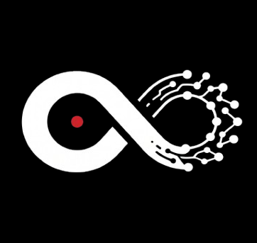

<p align="center">
  
</p>

<p align="center">
  <strong>A desktop interface forge for OpenCode remote agents and local coding-agent CLIs.</strong>
</p>

<p align="center">
  
</p>

<p align="center">
  <a href="LICENSE"></a>
  
  
  
  
</p>

<p align="center">
  <strong>Chisl palette</strong><br />
  
  
  
  
  
</p>

---

## What Chisl Does

Chisl is a desktop client for driving coding agents through a durable UI instead of a raw terminal. Its primary path is connecting the desktop app to a registered **OpenCode remote agent**. It also supports local CLI-backed agent sessions.

Chisl does not prescribe where project files, secrets, or execution context live. Context and tools can be supplied through the configured agent runtime and MCP/tooling connectors.

Supported workflows visible in the codebase:

| Workflow              | What Chisl exposes                                                                                                                                                                               |
| --------------------- | ------------------------------------------------------------------------------------------------------------------------------------------------------------------------------------------------ |
| OpenCode remote agent | Register a remote endpoint, test/handshake it, fetch model metadata, send messages, attach files, use OpenCode modes, slash commands, stop active runs, and inspect context usage when reported. |
| OpenCode local        | Use a detected local OpenCode-style agent from the same chat interface.                                                                                                                          |
| Claude Code           | Use detected Claude Code sessions through the local-agent flow.                                                                                                                                  |
| Gemini CLI            | Use Gemini CLI-backed sessions and Gemini modes.                                                                                                                                                 |
| Codex                 | Use Codex sessions with Chisl conversation, tool-call, and permission UI.                                                                                                                        |
| Custom local agent    | Define an ACP-style command, args, env, icon, and advanced settings from the Agent settings page.                                                                                                |

## Feature Map

This section documents features from the implementation rather than product guesses.

| Feature set                     | What exists                                                                                                                                                                                                                          | Source anchors                                                                                                                                                                                                                           |
| ------------------------------- | ------------------------------------------------------------------------------------------------------------------------------------------------------------------------------------------------------------------------------------ | ---------------------------------------------------------------------------------------------------------------------------------------------------------------------------------------------------------------------------------------- |
| Remote agent registry           | Add, edit, delete, list, test connection, and handshake remote agents. Config includes name, protocol, URL, auth type, auth token/password, avatar, description, and insecure TLS toggle.                                            | `packages/desktop/src/renderer/pages/settings/AgentSettings/RemoteAgentManagement.tsx`, `packages/desktop/src/common/types/agent/remoteAgentTypes.ts`                                                                                    |
| OpenCode remote model discovery | Registered OpenCode remote agents can have model metadata refreshed from the backend route that calls the OpenCode daemon provider endpoint.                                                                                         | `packages/desktop/src/renderer/utils/model/remoteAgentModels.ts`, `packages/desktop/src/common/adapter/ipcBridge.ts`                                                                                                                     |
| Agent picker integration        | Remote-agent rows are merged into the same start-page agent list as detected local agents.                                                                                                                                           | `packages/desktop/src/renderer/pages/guid/hooks/useGuidAgentSelection.ts`                                                                                                                                                                |
| OpenCode-specific controls      | OpenCode remote sessions enable mode switching and slash-command discovery; those controls are gated on `protocol === 'opencode'`.                                                                                                   | `packages/desktop/src/renderer/pages/conversation/platforms/remote/RemoteSendBox.tsx`                                                                                                                                                    |
| Conversation sending            | Messages are sent through the shared conversation bridge. Selected local files and workspace items are serialized as file paths alongside the prompt.                                                                                | `packages/desktop/src/renderer/pages/conversation/platforms/remote/RemoteSendBox.tsx`                                                                                                                                                    |
| Command queue                   | When a conversation is busy, new prompts can be queued, reordered, paused, resumed, edited, removed, or cleared.                                                                                                                     | `packages/desktop/src/renderer/pages/conversation/platforms/remote/RemoteSendBox.tsx`, `packages/desktop/src/renderer/pages/conversation/platforms/useConversationCommandQueue.ts`                                                       |
| Stop and running state          | Active remote runs can be stopped from the send box; stream/thought/running state is handled by the remote-message hook.                                                                                                             | `packages/desktop/src/renderer/pages/conversation/platforms/remote/RemoteSendBox.tsx`, `packages/desktop/src/renderer/pages/conversation/platforms/remote/useRemoteMessage.ts`                                                           |
| Context usage display           | The remote send box shows token/context usage when the backend reports it.                                                                                                                                                           | `packages/desktop/src/renderer/components/agent/ContextUsageIndicator.tsx`, `packages/desktop/src/renderer/pages/conversation/platforms/remote/RemoteSendBox.tsx`                                                                        |
| Session lifecycle actions       | OpenCode remote sessions expose fork, revert/restore-reverted, share/unshare (link), summarize/compact, file-changes (diff) view, and an editable server-config panel from a conversation-header menu.                               | `packages/desktop/src/renderer/pages/conversation/platforms/remote/RemoteSessionActions.tsx`                                                                                                                                            |
| Compaction awareness            | When the server compacts a session (auto or manual), Chisl surfaces a notification with tokens reclaimed; manual compact uses the V2 endpoint with a V1 summarize fallback.                                                          | `packages/desktop/src/renderer/pages/conversation/platforms/remote/useRemoteMessage.ts`, `packages/desktop/src/renderer/pages/conversation/platforms/remote/RemoteSessionActions.tsx`                                                    |
| Server-state pills              | OpenCode sessions show a conversation-header pill for the connected server name with a quick-switch dropdown, plus a tool-host (local/server) badge; in server-tool-host mode they also show LSP server status and VCS branch/changes pills.                     | `packages/desktop/src/renderer/pages/conversation/platforms/remote/RemoteServerBadge.tsx`, `.../RemoteToolHostBadge.tsx`, `.../RemoteLspBadge.tsx`, `.../RemoteVcsBadge.tsx`                                                              |
| Multi-server health & default   | Settings shows live per-agent health (polled probe + manual refresh) and a default-server preference badge persisted to local storage.                                                                                              | `packages/desktop/src/renderer/hooks/agent/useRemoteAgentHealth.ts`, `packages/desktop/src/common/utils/defaultRemoteAgent.ts`, `packages/desktop/src/renderer/pages/settings/AgentSettings/RemoteAgentManagement.tsx`                   |
| Skills injection                | OpenCode remote sessions can attach server-side skills to outgoing prompts from a picker in the send box; the selection is sticky across messages.                                                                                   | `packages/desktop/src/renderer/hooks/chat/useRemoteSkills.ts`, `packages/desktop/src/renderer/pages/conversation/platforms/remote/RemoteSendBox.tsx`                                                                                     |
| Permissions & approvals         | Tool-permission and `/question` requests surface as per-call approval cards, a pending-approvals banner, and a dedicated workspace Approvals tab; bulk-approve is supported.                                                          | `packages/desktop/src/renderer/pages/conversation/components/PendingApprovalsBanner.tsx`, `packages/desktop/src/renderer/pages/conversation/Workspace/components/ApprovalsList.tsx`, `.../Messages/acp/MessageAcpPermission.tsx`         |
| Sub-agents (subtasks)           | OpenCode child sessions render as inline collapsible subtask cards with a rolling summary in the parent transcript.                                                                                                                  | `packages/desktop/src/renderer/pages/conversation/Messages/acp/MessageOpencodeSubtask.tsx`                                                                                                                                              |
| Edit/delete messages            | User messages and message parts in OpenCode remote conversations can be edited or deleted (mapped to the server's fork/revert primitives).                                                                                           | `packages/desktop/src/renderer/pages/conversation/platforms/remote/useRemoteMessage.ts`, `packages/desktop/src/common/adapter/ipcBridge.ts`                                                                                              |
| Local detected agents           | Detected local agents are displayed in Agent settings and can be opened directly in chat.                                                                                                                                            | `packages/desktop/src/renderer/pages/settings/AgentSettings/LocalAgents.tsx`                                                                                                                                                             |
| Custom local agents             | Users can create, edit, enable/disable, and delete custom command-based agents.                                                                                                                                                      | `packages/desktop/src/renderer/pages/settings/AgentSettings/LocalAgents.tsx`, `packages/desktop/src/renderer/pages/settings/AgentSettings/InlineAgentEditor.tsx`                                                                         |
| MCP and tools                   | Capabilities settings include MCP server management and speech-to-text settings. MCP server operations include add, batch import, edit, delete, enable/disable, connection testing, OAuth status/login, and sync/remove with agents. | `packages/desktop/src/renderer/pages/settings/CapabilitiesSettings.tsx`, `packages/desktop/src/renderer/components/settings/SettingsModal/contents/ToolsModalContent.tsx`                                                                |
| Skills                          | Skills settings list available built-in, custom, and extension skills; support search, refresh, folder import, symlink import, and delete.                                                                                           | `packages/desktop/src/renderer/pages/settings/SkillsHubSettings.tsx`                                                                                                                                                                     |
| Display and branding            | Chisl is the default color scheme; the "Theme" toggle disables the Chisl override so the active CSS theme preset (Catppuccin, built in) drives variables instead.                                                                    | `packages/desktop/src/renderer/styles/themes/chisl-color-scheme.css`, `packages/desktop/src/renderer/pages/settings/DisplaySettings/presets/catppuccin.css`, `packages/desktop/src/renderer/components/settings/ColorSchemeSwitcher.tsx` |

## Remote OpenCode Flow

The remote OpenCode path is configured as a remote-agent entry in Agent settings.

Code-backed behavior:

| Step               | Behavior                                                                                                                                                                            |
| ------------------ | ----------------------------------------------------------------------------------------------------------------------------------------------------------------------------------- |
| Register endpoint  | Add a remote agent with protocol `opencode`, URL, auth type, and optional token/password.                                                                                           |
| Test connection    | The settings modal calls the remote-agent test route before saving if requested.                                                                                                    |
| Save and handshake | Saving an OpenCode remote agent triggers a handshake.                                                                                                                               |
| Select in chat     | Registered remote agents are merged into the start-page agent picker.                                                                                                               |
| Fetch models       | OpenCode remote agents can refresh available models from the remote provider endpoint through the backend.                                                                          |
| Chat               | Messages go through the shared conversation send bridge.                                                                                                                            |
| Add context        | File attachments and selected workspace items are sent with the message as file paths. MCP/tool connectors can provide additional runtime context outside the README's assumptions. |
| Control the run    | The UI can stop a run, queue additional prompts, and show mode/skills/context controls when available.                                                                              |
| Manage the session | A conversation-header menu exposes fork, revert/restore, share/unshare, summarize/compact, file-changes (diff), and an editable server-config panel.                                |
| Inspect server state | In server-tool-host mode, header pills show the connected server (with quick-switch), LSP status, and VCS branch/changes; permission and `/question` prompts route to the Approvals UI. |

## Local Agent Flow

Local agents are secondary but supported.

Code-backed behavior:

| Feature          | Behavior                                                                                                              |
| ---------------- | --------------------------------------------------------------------------------------------------------------------- |
| Detected agents  | The Agent settings page reads detected local agents and shows them as chat targets.                                   |
| Custom agents    | Users can define a command, args, env, icon, and advanced options for a custom agent.                                 |
| Agent launch     | The start page restores or preselects available agents and routes to conversation creation.                           |
| Modes and models | The start page resolves mode/model metadata from agent config, handshake data, or remote model cache where available. |

## MCP, Skills, And Context

Chisl includes UI for managing MCP servers and skills. These are the appropriate places to document tool/context integration; the README should not prescribe endpoint filesystem or secret layout.

| Area        | Behavior                                                                                                |
| ----------- | ------------------------------------------------------------------------------------------------------- |
| MCP servers | Add, import, edit, delete, enable/disable, test, authenticate, and sync MCP servers to agents.          |
| Skills      | Browse built-in/custom/extension skills, import skill folders, search, refresh, and delete user skills. |
| Voice       | Configure speech-to-text providers for voice input.                                                     |

## Branding

The README uses the same in-repo brand assets as the application.

| Asset         | Path                                                                 |
| ------------- | -------------------------------------------------------------------- |
| Wordmark      | `packages/desktop/src/renderer/assets/logos/brand/wordmark.png`      |
| App mark      | `packages/desktop/src/renderer/assets/logos/brand/app.png`           |
| Gray wordmark | `packages/desktop/src/renderer/assets/logos/brand/wordmark-gray.png` |
| Packaged icon | `resources/app.png`                                                  |

The Chisl color scheme is a muted retro palette sampled from the logo and wordmark.

| Role              | Light     | Dark      |
| ----------------- | --------- | --------- |
| Rust primary      | `#b4480c` | `#e07820` |
| Parchment surface | `#f0e4b4` | `#28241d` |
| Ink text          | `#303024` | `#ecdfb6` |
| Olive success     | `#607848` | `#8aa860` |
| Gold warning      | `#c08418` | `#e4b430` |
| Slate info        | `#3c786c` | `#6caa9c` |

## Quick Start

Install dependencies:

```bash
bun install
```

Run the desktop app:

```bash
bun run dev
```

Build the app output:

```bash
bun run package
```

Create packaged desktop artifacts:

```bash
bun run dist
```

## Development Checks

Useful local checks:

```bash
bun run lint
bun run format:check
bunx tsc --noEmit
bun run test
```

If you change user-facing text or locale files, also run:

```bash
bun run i18n:types
node scripts/check-i18n.js
```

## Documentation

| Topic                | Path                                  |
| -------------------- | ------------------------------------- |
| Contributor guide    | `CONTRIBUTING.md`                     |
| Development setup    | `docs/contributing/development.md`    |
| File structure rules | `docs/contributing/file-structure.md` |

## Status

Chisl is moving quickly. The README intentionally documents only features verified from the current codebase.

## License

Licensed under [Apache-2.0](LICENSE).

## Attribution

Chisl is derived from an Apache-2.0 licensed project. Substantial modifications have been made, including changes to branding, UI, workflows, agent integrations, and application behavior.

Original copyright and license notices are preserved in accordance with the Apache License 2.0.
