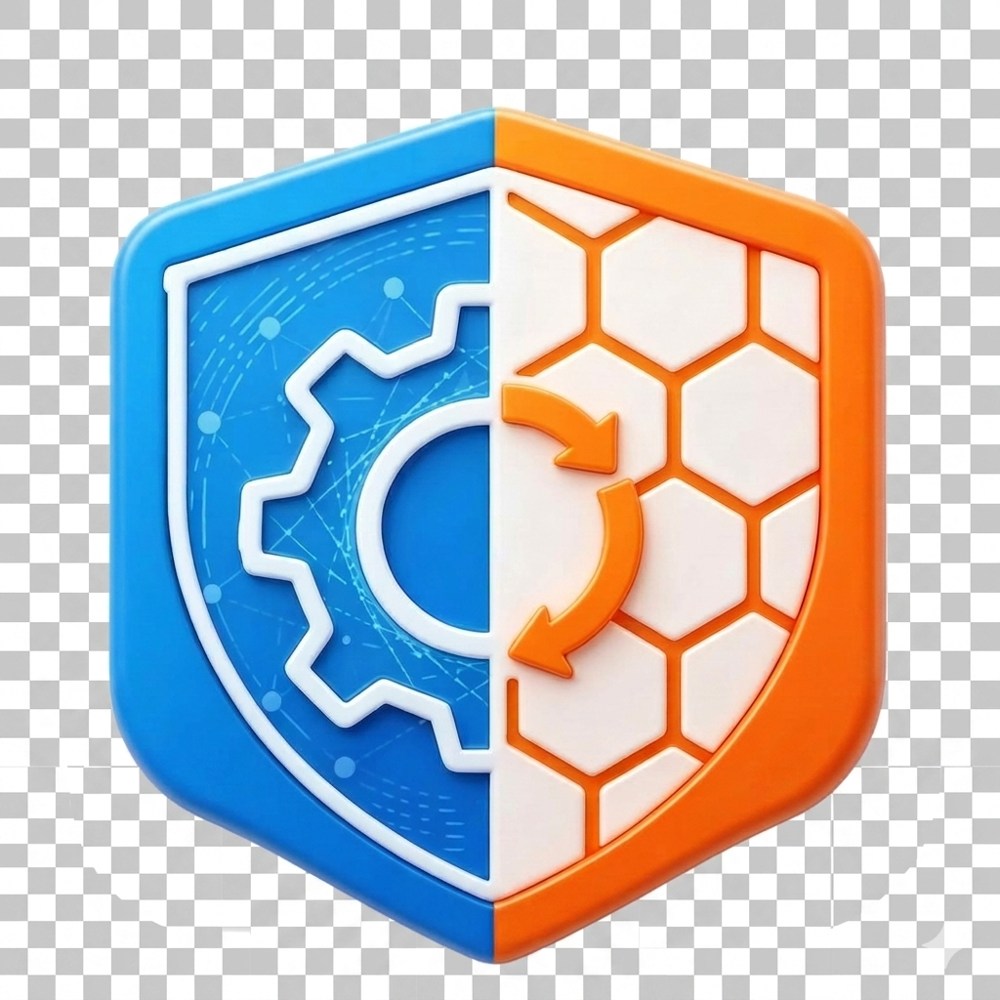

<p align="center">
  
</p>

<h1 align="center">AICore Desktop</h1>

<p align="center">
  <strong>企业级 AI 协作桌面平台 · 金山云 KSC 深度集成</strong><br>
  <em>KSC 一键登录 · 企业模型代理 · 精简助手体系 · 增强输入体验 · 私有化部署</em>
</p>

<p align="center">
  
  &nbsp;
  
</p>

---

## 🆕 本分支（`clt`）特有功能

本分支基于 AionUi 上游，面向企业私有化场景进行了深度定制。以下是区别于上游 `main` 分支的核心改动：

### 🔐 金山云 KSC 一键登录

- **Titlebar 内嵌登录入口** — 点击标题栏用户图标即可发起 KSC OAuth 登录流程，无需手动配置 API Key
- **登录状态持久化** — 用户信息（用户名、企业名称）缓存至 localStorage，刷新不丢失
- **一键登出** — 标题栏直接退出，清除本地凭证
- **默认企业码** — 内置 `camelotklt` 企业码，开箱即用

### 🔄 KSC 模型代理（KSC Proxy）

- **本地反向代理** — 新增 `/api/ksc-proxy/:providerId` 路由，将前端请求透传至 KSC 推理服务，自动注入 Bearer Token
- **仅限本机访问** — 代理仅接受 `127.0.0.1` / `::1` 请求，拒绝外部访问
- **重试与容错** — 内置 3 次重试（408/425/429/5xx），45 秒超时
- **独立限流** — KSC 代理 600 次/分钟，避免与通用 API 限流互相干扰
- **Aionrs 自动适配** — `ensureKscProxyModel()` 在启动 aionrs 进程前自动将 KSC Provider 的 baseUrl 重写为本地代理地址

### 🏢 品牌重塑：AICore Desktop

| 维度 | 上游 AionUi | 本分支 AICore Desktop |
|:-----|:-----------|:---------------------|
| 产品名 | AionUi | **AICore** |
| 包名 / appId | `com.aionui.app` | `com.aicore.aicoredesktop` |
| 可执行文件名 | AionUi | **AICoreDesktop** |
| 深度链接协议 | `aionui://` | `aicoredesktop://` |
| 配置目录 | `.aionui` | `.aicoredesktop` |
| 标题栏 Logo | SVG 图标 | **自定义 PNG 品牌 Logo** |

### ✂️ 精简助手体系

上游 20 个内置助手精简为 **3 个核心助手**，首页仅展示精选：

| 助手 | 说明 |
|:-----|:-----|
| 🤝 **Cowork 协作助手** | 自主任务执行、文件操作、文档处理、多步骤工作流规划 |
| 📋 **文件规划助手** | Manus 风格持久化文件规划（task_plan.md / findings.md / progress.md） |
| 📈 **Mermaid 图表助手** | 流程图、时序图、状态图、类图、ER 图，多主题 |

> 其余 17 个助手（PPT Creator、Word Creator、Excel Creator、Academic Paper Writer 等）已移除，减少首页噪音。

### ✍️ 增强输入体验

- **输入框更大** — 单行最小高度 42px，多行最小高度 108px，默认 5 行起
- **字体更大** — 输入区字体从 14px 提升至 **16px**，行高 28px
- **圆角更圆润** — SendBox 圆角从 20px → 28px，内边距从 16px → 24px
- **工作区标签高亮** — 当前工作区路径以主题色高亮显示，更醒目

### 🚫 移除的功能

| 移除项 | 原因 |
|:-------|:-----|
| 🐾 桌面宠物（Pet） | 托盘菜单及 Pet 相关功能已移除 |
| 🫧 Ambient Mode | 气泡窗口及 ambient 模式全部移除 |
| 🛒 技能市场 Banner | 首页 SkillsMarketBanner 组件已移除 |
| 📝 反馈报告弹窗 | FeedbackReportModal 已移除 |
| 🔄 CDN 加速下载 | 更新下载回退为直连 GitHub，移除 CDN 重写逻辑 |
| 🔍 托盘"关于"入口 | 托盘菜单精简，移除"关于"和"检查更新"快捷入口 |

### 🛠️ 其他改进

- **Aionrs 启动诊断增强** — 进程异常退出时输出 stderr 摘要、Provider 信息和启动参数，便于排查
- **Session 冲突自动恢复** — aionrs 创建 session 失败时自动回退为 resume 模式
- **KSC 心跳容差放宽** — KSC 代理模式下心跳最大丢失次数从 3 提升至 20，适应网络波动
- **更新入口临时禁用** — `isUpdateEntryDisabled = true`，避免私有化部署误触发上游更新
- **Windows 打包适配** — 新增 `build-win.ps1` / `build-win.sh`，完善 Windows 构建流程
- **macOS DMG 构建** — 新增 `build-dmg.sh`，支持定制化 DMG 打包

---

## 🏗️ 架构概览

```
┌─────────────────────────────────────────────────┐
│                  Renderer (React)                │
│  ┌──────────┐  ┌──────────┐  ┌───────────────┐  │
│  │ Titlebar │  │ GuidPage │  │ SettingsModal │  │
│  │ KSC 登录 │  │ 精简首页  │  │ 更新/关于     │  │
│  └──────────┘  └──────────┘  └───────────────┘  │
├─────────────────────────────────────────────────┤
│                  Main Process                    │
│  ┌──────────┐  ┌──────────┐  ┌───────────────┐  │
│  │ kscBridge│  │ kscProxy │  │  apiRoutes    │  │
│  │ 登录/同步 │  │ URL 重写  │  │ KSC 代理路由  │  │
│  └──────────┘  └──────────┘  └───────────────┘  │
│  ┌──────────┐  ┌──────────┐  ┌───────────────┐  │
│  │ Aionrs   │  │updateBrg │  │   tray        │  │
│  │ 启动诊断  │  │ 直连下载  │  │  精简菜单     │  │
│  └──────────┘  └──────────┘  └───────────────┘  │
├─────────────────────────────────────────────────┤
│              KSC Inference Service               │
│         (camelotklt.kscc.api.ksyun.com)          │
└─────────────────────────────────────────────────┘
```

---

## 🚀 快速开始

### 系统要求

- **macOS**: 10.15+
- **Windows**: Windows 10+
- **Linux**: Ubuntu 18.04+ / Debian 10+ / Fedora 32+
- **内存**: 4GB+ 推荐
- **存储**: 500MB+ 可用空间

### 开发

Tech stack: Electron · Vite · React · Bun

```bash
bun install        # 安装依赖
bun run dev        # 启动开发服务器
bun run test       # 运行单元测试
```

### 构建

```bash
# macOS
bash build-dmg.sh

# Windows
bash build-win.sh
# 或 PowerShell
.\build-win.ps1
```

---

## 📖 KSC 配置指南

### 1. 登录

1. 启动 AICore Desktop
2. 点击标题栏右侧 **用户图标**
3. 确认 KSC Base URL（默认 `https://camelotklt.kscc.api.ksyun.com`）
4. 点击确认，浏览器将打开 KSC OAuth 登录页
5. 登录成功后，用户名和企业信息将显示在标题栏

### 2. 模型代理

KSC 登录成功后，系统会自动：

- 将 KSC 推理模型注册为本地 Provider
- 通过 `/api/ksc-proxy/` 路由代理请求至 KSC 推理服务
- 在 aionrs (AICore CLI) 启动时自动注入代理地址

> 💡 代理仅限本机访问，无需担心外部暴露。

### 故障排查

详见 [docs/guides/ksc-troubleshooting.md](docs/guides/ksc-troubleshooting.md)

---

## 🤝 贡献

请阅读 [CONTRIBUTING.md](CONTRIBUTING.md) 后提交 PR。

---

## 📄 License

[Apache-2.0](LICENSE)
